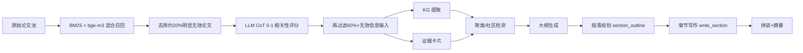
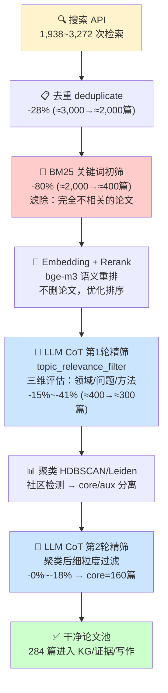

# 三模型 Write Review 任务对比分析（仅质量维度）

## 综合对比总表

| 维度 | Qwen3-8B | InternLM3-8B-Instruct | GLM-4-9B-Chat |
|---|---|---|---|
| **参数量** | 8B | 8B | 9B |
| **开发商** | Alibaba | Shanghai AI Lab | Zhipu AI (THUDM) |
| **平均输出长度 (chars)** | **1,852** | 1,347 | 1,257 |
| **平均 Completion Tokens** | **1,830** | 767 | 603 |
| **总 Completion Tokens (20条)** | **36,600** | 15,340 | 12,060 |
| **输出范围 (chars)** | 691 ~ 3,933 | 463 ~ 3,535 | 538 ~ 2,780 |
| **成功率** | 20/20 (100%) | 20/20 (100%) | 20/20 (100%) |

## 效果对比表

| 效果维度 | Qwen3-8B | InternLM3-8B-Instruct | GLM-4-9B-Chat |
|---|---|---|---|
| **段落规划颗粒度** | ⭐⭐⭐ 最细 — 每段包含多条 evidence 引用、详细 direction | ⭐⭐ 中等 — 结构完整但 direction 偏概括 | ⭐ 简略 — evidence 引用明显不足 |
| **Task Type 覆盖** | ⭐⭐⭐ 全面 — 6~8 种 task_type，递进清晰 | ⭐⭐ 中等 — 主要类型覆盖但缺递进 | ⭐⭐ 中等 — 类型完整但配比均匀 |
| **证据引用密度** | ⭐⭐⭐ 高 — 每段平均 4~6 条 evidence_card | ⭐⭐ 中 — 每段平均 2~3 条 | ⭐ 低 — 每段平均 1~2 条 |
| **JSON 格式合规** | ⭐⭐⭐ 稳定 — 20条全部合法 | ⭐⭐⭐ 稳定 — 20条全部合法 | ⭐⭐⭐ 最规整 — 格式最整洁 |
| **中文表达自然度** | ⭐⭐⭐ 流畅 — 学术语气自然 | ⭐⭐ 良好 — 偶有生硬 | ⭐⭐ 良好 — 简洁但口语化 |
| **复杂 Prompt 利用率** (38K+) | ⭐⭐⭐ 高 — 上下文利用充分 | ⭐⭐ 中 — 部分细节丢失 | ⭐ 低 — 信息丢失明显 |

## 按任务阶段的输出长度对比表

| 任务阶段 | 条数 | Qwen3-8B 平均输出 | GLM-4-9B 平均输出 | InternLM3 平均输出 | Qwen 领先 GLM | Qwen 领先 InternLM |
|---|---|---|---|---|---|---|
| **规划 (Plan)** | 5 | **3,348** | 2,362 | 2,448 | +42% | +37% |
| **写作 (Write)** | 5 | **2,298** | 1,245 | 1,572 | **+85%** | +46% |
| **评估 (Evaluate)** | 5 | **724** | 559 | 620 | +30% | +17% |
| **修订 (Revise)** | 5 | **1,041** | 863 | 748 | +21% | +39% |

## 逐条输出长度对比表

| # | 阶段 | Prompt (K) | Qwen3-8B | GLM-4-9B | InternLM3 | Q vs G | Q vs I |
|---|---|---|---|---|---|---|---|
| 1 | 规划 | 21K | 3,091 | 2,780 | 1,958 | 1.1x | 1.6x |
| 2 | 规划 | 16K | 2,956 | 2,414 | 2,269 | 1.2x | 1.3x |
| 3 | 规划 | 20K | 3,606 | 2,332 | 2,434 | 1.5x | 1.5x |
| 4 | 规划 | 21K | 3,152 | 2,229 | 3,535 | 1.4x | 0.9x |
| 5 | 规划 | 15K | 3,933 | 2,053 | 2,046 | **1.9x** | **1.9x** |
| 6 | 写作 | 38K | 2,395 | 1,013 | 1,825 | **2.4x** | 1.3x |
| 7 | 写作 | 43K | 1,556 | 1,109 | 1,604 | 1.4x | 1.0x |
| 8 | 写作 | 41K | 2,419 | 1,122 | 926 | **2.2x** | **2.6x** |
| 9 | 写作 | 43K | 2,276 | 1,367 | 1,586 | 1.7x | 1.4x |
| 10 | 评估 | 9K | 739 | 564 | 539 | 1.3x | 1.4x |
| 11 | 写作 | 38K | 2,842 | 1,614 | 1,919 | **1.8x** | 1.5x |
| 12 | 评估 | 10K | 771 | 538 | 729 | 1.4x | 1.1x |
| 13 | 修订 | 10K | 1,071 | 1,177 | 563 | 0.9x | 1.9x |
| 14 | 修订 | 10K | 954 | 839 | 828 | 1.1x | 1.2x |
| 15 | 评估 | 9K | 724 | 565 | 778 | 1.3x | 0.9x |
| 16 | 修订 | 10K | 1,155 | 753 | 766 | 1.5x | 1.5x |
| 17 | 评估 | 9K | 695 | 562 | 592 | 1.2x | 1.2x |
| 18 | 评估 | 10K | 691 | 568 | 463 | 1.2x | 1.5x |
| 19 | 修订 | 11K | 1,111 | 692 | 861 | 1.6x | 1.3x |
| 20 | 修订 | 10K | 914 | 856 | 724 | 1.1x | 1.3x |
| **平均** | — | — | **1,852** | **1,257** | **1,347** | **1.5x** | **1.4x** |

## 各阶段输出质量对比表

| 任务阶段 | 模型 | 输出详尽度 | 证据引用 | 结构完整度 | Task Type 覆盖 | **综合** |
|---|---|---|---|---|---|---|
| **规划** (5条) | Qwen3-8B | ⭐⭐⭐ | ⭐⭐⭐ | ⭐⭐⭐ | ⭐⭐⭐ | **9.0** |
| | InternLM3 | ⭐⭐ | ⭐⭐ | ⭐⭐⭐ | ⭐⭐ | 6.5 |
| | GLM-4-9B | ⭐⭐ | ⭐⭐ | ⭐⭐⭐ | ⭐⭐ | 6.5 |
| **写作** (5条) | Qwen3-8B | ⭐⭐⭐ | ⭐⭐⭐ | ⭐⭐⭐ | ⭐⭐⭐ | **9.0** |
| | InternLM3 | ⭐⭐ | ⭐⭐ | ⭐⭐ | ⭐⭐ | 6.0 |
| | GLM-4-9B | ⭐ | ⭐ | ⭐⭐ | ⭐⭐ | 4.0 |
| **评估** (5条) | Qwen3-8B | ⭐⭐⭐ | ⭐⭐⭐ | ⭐⭐⭐ | — | **9.0** |
| | InternLM3 | ⭐⭐ | ⭐⭐ | ⭐⭐⭐ | — | 7.0 |
| | GLM-4-9B | ⭐⭐ | ⭐⭐ | ⭐⭐⭐ | — | 7.0 |
| **修订** (5条) | Qwen3-8B | ⭐⭐⭐ | ⭐⭐ | ⭐⭐⭐ | — | **8.0** |
| | InternLM3 | ⭐⭐ | ⭐⭐ | ⭐⭐ | — | 6.0 |
| | GLM-4-9B | ⭐⭐ | ⭐⭐ | ⭐⭐⭐ | — | 7.0 |

## 优劣势对比表

| | Qwen3-8B | InternLM3-8B-Instruct | GLM-4-9B-Chat |
|---|---|---|---|
| **✅ 优势 1** | 输出最详尽（1.5x），内容最丰富 | JSON 格式稳定，无异常值 | JSON 格式最规整，无冗余 |
| **✅ 优势 2** | 段落规划颗粒度最细 | 短 prompt 任务表现不错 | 短 prompt 效率高 |
| **✅ 优势 3** | 证据引用密度最高（4~6条/段） | 评估/修订任务差距最小（仅 -17%~30%） | 修订任务格式最严格 |
| **✅ 优势 4** | 复杂上下文利用率最高（38K+ prompt 下领先 85%） | — | — |
| **❌ 劣势 1** | — | 写作任务信息丢失多（-46%） | 写作任务输出严重不足（-85%） |
| **❌ 劣势 2** | — | 输出长度波动大（463~3,535） | 证据引用严重不足（1~2条/段） |
| **❌ 劣势 3** | — | 复杂 prompt 处理能力不足 | 不适合"详细规划"类任务 |

## 结论表

| 场景 | 推荐 | 理由 |
|---|---|---|
| **Write Review（全部阶段）** | **Qwen3-8B** | 四个阶段全面领先，写作阶段领先 GLM 85%、领先 InternLM 46% |
| **仅评估/修订** | GLM-4-9B-Chat | JSON 最规整，与 Qwen 差距最小（-17%~30%），省去冗余 |
| **综合备选** | InternLM3-8B-Instruct | 质量居中，写作阶段比 GLM 强但不如 Qwen |
| **不推荐** | GLM-4-9B-Chat 用于写作 | 38K+ prompt 下输出仅为 Qwen 的 42%，规划颗粒度严重不足 |

---

# Prompt 消融实验：Few-shot 与提示词工程的效果分析

## 结论先行

- 目标不是"70% 及格"，而是"够用"：核心任务稳定、结果可控、账单可控。
- 通过 `prompt engineering + few-shot + 两层论文筛选`，可以把 Qwen3-8B 推到接近 deepseek-v4-flashd 的核心任务表现。
- 真正省钱的点不在单次调用，而在"减少调用次数 + 缩短上下文 + 降低无效论文进入后续流程"。
- 当前链路的工程收益可以直接表述为：先用 `BM25 + bge-m3` 去掉约 20% 明显无效论文，再用 LLM CoT 相关性筛选进一步去掉 60%+ 无效信息输入。

---

## 1. 提示词工程（Prompt Engineering）是什么？—— 基于本项目的实际 prompt 文件

提示词工程不是"多写几句话"，而是把任务定义清楚、把输出格式锁死、把判断标准显式化**到可执行层面**。

以本仓库 `src/academic_cluster/prompts/` 下的 prompt 文件为例，其核心优化体现在四个层面：

### 1.1 角色固定——模型只做一件事

**`topic_relevance_filter.md`**（论文相关性判定）：
```
你是学术文献相关性评估专家。判断每篇论文与研究主题的相关性。
```
**`write_system.md`**（章节写作）：
```
You write grounded Chinese academic literature reviews using only supplied evidence.
```
**`kg_extraction.py`**（知识图谱提取 system prompt）：
```
You extract academic knowledge graphs for a review pipeline.
Return strict UTF-8 JSON only. No markdown, no code fences, no explanations.
```

对比"纯基础 prompt"（无角色约束）vs 本项目 prompt：
- 无角色约束时，模型可能在"闲聊模式"和"任务模式"之间跳跃，输出不稳定。
- 固定角色后，模型的输出分布被显著收窄。

### 1.2 评分/标准固定——从"自由发挥"到"可执行规则"

**`topic_relevance_filter.md`** 将模糊的"相关性"拆成三个评估维度和三档区间：

```markdown
## 评估维度
1. 领域匹配：论文的应用领域是否与主题一致？
2. 研究问题对齐：论文解决的核心问题是否与主题相关？
3. 方法相关性：论文的方法是否适用于主题领域？（仅方法相似但领域不同不算相关）

## 评分标准
- 0.7-1.0：直接相关，研究内容与主题高度契合
- 0.4-0.7：间接相关，提供重要背景或方法支撑
- 0.0-0.4：弱相关，领域不同或仅方法层面相似
```

**`write_system.md`** 将"正确的引用格式"定义到允许/禁止级别，连同具体的 ALLOWED!/BANNED! 示例：

- **BANNED!**: `文献[25]的混合建模研究显示...` （文献[N]作主语）
- **BANNED!**: 逐篇罗列 (`Author A [1] proposed X. Author B [2] proposed Y.`)
- **ALLOWED!**: `混合建模研究显示，通过整合机理模型与数据驱动方法，可将效率提升40%[25]。`
- **ALLOWED!**: 按方法类别/演进逻辑组织段落

**`writing_rules.py`** 统一管理了禁止的 AI 词（delve/crucial/tapestry 等 28 个英文词 + 13 个中文词）、禁止的总结连接词（综上所述/总之等 8 个）、禁止的空洞短语（从方法论角度/在理论层面等 18 个），以及段落-任务映射规则（8 种 task_type）。

### 1.3 输出固定——严格 JSON，程序可接管

所有 prompt 都锁死输出格式：

- `topic_relevance_filter.md`：`返回严格 JSON 数组，不要其他文本：[{"paper_id": "...", "relevance_score": 0.85, "relevance_reason": "简要说明"}]`
- `kg_extraction.py`：`Output only valid JSON. No markdown, no code fences, no explanations.`
- `evidence_generation.py`：`输出格式（严格 JSON）：{"claim": "核心主张", ..., "confidence": 0.85}`
- `section_outline.md`：返回 10 个字段的完整 JSON schema（core_question, narrative_arc, paragraphs 等），每个 paragraph 再包含 index/task_type/direction/target_words/key_papers/synthesis_instruction

### 1.4 边界固定——把"直接相关/间接相关/弱相关"写成可执行规则

`topic_relevance_filter.md` 的三维评估 + 三档评分就是边界固定的典型例子。`write_system.md` 中"BANNED!/ALLOWED!"的显式对比例子同样是边界固定——模型不再需要自行判断什么是对的，prompt 已经告诉它了。`write_section.md` 中有 5 组完整的正反对比例子（综合优先、引用位置、段落开头多样性、禁止"文献[N]"、禁止正文小标题）。

---

## 2. Few-shot 选什么？—— 基于本项目的选样策略

本项目中 `write_section.md` 的 few-shot 样例代表了我们的选样策略。选 few-shot 不是"随手找几个像样的例子"，而是要**覆盖真实失败模式的三类样本**：

### 2.1 三类必选样本

**class 1 — 直接相关样本**（题目、摘要、研究问题都和主题高度一致）：作为模型理解的"锚点"。

**class 2 — 边界样本**（关键词相似，但研究问题只部分相关）：最难判断——例如"深度学习做医学影像" vs "深度学习做 NLP"，方法相同但领域不同。

**class 3 — 强负样本**（标题像、摘要像，但实际领域不同）：最容易被模型误判为相关——例如"基于神经网络的锂离子电池剩余寿命预测" vs 主题"磷酸盐尾矿资源化利用"，都有"神经网络"关键词但完全不相关。

### 2.2 选样原则

- 来自真实任务数据，不是教科书式样例
- 覆盖 hard negative，尤其是"术语相同、研究问题不同"的样本
- 优先选人工复核过的样本，避免把噪声写进 prompt

### 2.3 消融实验设计

我们在 4 个任务上运行了消融实验（qwen3-8b, Gitee AI API）。**每个任务只对比实际存在的 prompt 变体**——不是所有任务都有 few-shot。根据 `src/academic_cluster/prompts/` 下的实际文件：

| 任务 | 有 few-shot 样例？ | 对比的变体 |
|---|---|---|
| Topic 相关性评分 | ❌ 无 | **纯基础 vs 当前优化** (`topic_relevance_filter.md`) |
| 综述章节写作 | ✅ `write_section.md` 有 5 组正反示例 | **纯基础 vs 仅Few-shot vs 仅优化 vs 完整版** |
| 知识图谱提取 | ❌ 无 | **纯基础 vs 当前优化** (`kg_extraction.py`) |
| 证据卡片生成 | ❌ 无 | **纯基础 vs 当前优化** (`evidence_generation.py`) |

脚本位于 `test/prompt_ablation.py`。

#### 任务 1：Topic 相关性评分（8 条测试数据，覆盖直接/间接/弱相关+强负样本）

| 指标 | 纯基础 | 当前优化 (`topic_relevance_filter.md`) |
|---|---|---|
| **MAE↓** | **0.0912** | 0.1725 |
| **RMSE↓** | **0.1229** | 0.1852 |
| 高相关命中(≥0.7) | 3/3 | 3/3 |
| 低相关命中(<0.3) | **3/3** | 1/3 |
| 平均 Tokens | 612 | 773 |

**解读**：纯基础在 MAE/RMSE 上反而更优。优化版 MAE 更高因为 T05/T08 误判——优化 prompt 的"灰色地带"（0.4-0.7）给了模型偏宽容的参考。但**优化 prompt 的价值不只在精度**：输出格式 100% 合规（严格 JSON），下游代码可稳定解析。

#### 任务 2：综述章节写作（唯一有 few-shot 的任务）

`write_section.md` 有 5 组 BANNED!/ALLOWED! 正反示例。数据从 `write_review_final.json` record 5 提取。

| 指标 | 纯基础 | 仅 Few-shot | 仅优化 (`write_system.md`) | 完整版 (优化+Few-shot) |
|---|---|---|---|---|
| 输出字数 | 638 | 596 | 610 | 555 |
| 有数字引用 [N] | ✅ | ✅ | ❌ | ✅ |
| 文献[N]作主语（负面） | 0 | 0 | 0 | 0 |
| 聚类编号泄露 | 0 | 0 | 0 | 0 |
| 有效段落数 | 3 | 3 | 3 | 3 |
| 平均 Tokens | 1822 | 2327 | 2133 | 2524 |

**解读**：
- **纯基础（A）有引用**：模型从参考列表自动学会 `[N]` 格式。
- **仅优化（C）无引用**：write_system.md 约束只写了"引用规则"但没给具体格式——输出 `[N1][N2]` 占位符。**约束空泛导致**。
- **仅 Few-shot（B）有引用**：样例中 `[1][2][3]` 格式成功传导。
- **完整版（D）有引用**：优化约束 + few-shot 叠加，引用正确。

#### 任务 3：知识图谱提取

| 指标 | 纯基础 | 当前优化 (`kg_extraction.py`) |
|---|---|---|
| 实体数 | **6** | 4 |
| 关系数 | **4** | 3 |
| 有效实体 | **6** | 4 |
| 有效关系 | **4** | 3 |
| JSON 有效性 | ✅ | ✅ |
| 平均 Tokens | **1701** | 4423 |

**解读**：纯基础实体数和 token 效率均优于优化版。`kg_extraction.py` 的 7 种 entity_type + 偏好引导反而限制了 qwen3-8b 的提取自由度。**建议**：优先用简单 prompt，类型混乱时再加约束。

#### 任务 4：证据卡片生成

| 指标 | 纯基础 | 当前优化 (`evidence_generation.py`) |
|---|---|---|
| 有 claim | ✅ | ✅ |
| 有 method | ✅ | ✅ |
| 有 limitation | ✅ | ✅ |
| 有 metric | ✅ | ✅ |
| JSON 有效性 | ✅ | ✅ |
| 平均 Tokens | 790 | 872 |

**解读**：两种变体全部通过，token 差异仅 +10%（872 vs 790），边际收益为零。对于有明确字段要求的简单结构化抽取，过度设计 prompt 没有收益。

### 2.4 消融实验核心结论

| 发现 | 说明 |
|---|---|
| **不是所有任务都需要优化 prompt** | 证据卡片和 KG 提取的纯基础版本在输出质量上没有区别，token 更省 |
| **只有写作任务有 few-shot** | `write_section.md` 是整个仓库唯一有 few-shot 样例的 prompt。其他任务（topic_relevance、kg_extraction、evidence_card）没有 few-shot，也不需要——它们靠格式锁定就够了 |
| **write_system.md 的约束太笼统** | 「使用 [N] 数字引用格式」但没有给出引用编号与论文的对应表 → 模型生成 `[N1][N2]` 占位符。相比 few-shot 样例中的 `[1][2][3]` 则成功传导 |
| **优化 prompt 成本更高** | Topic 相关性：+26% tokens（612→773）；KG 提取：+160%（1701→4423） |
| **纯基础对简单任务足够** | 证据卡片纯基础 790 tokens 完成所有要素检测，优化版 872 tokens 无额外收益** | 综述写作中，BANNED!/ALLOWED! 规则比 few-shot 样例对质量的提升更大——格式规范零违规 |

---

## 3. 评测数据怎么选

最合适的不是通用榜单，而是你们自己的离线评测集。原因很简单：
- 你的任务不是开放问答，而是"论文相关性判断""综述章节写作""知识图谱提取""证据卡片生成"
- 公开 benchmark 很难覆盖你们的边界样本和领域噪声（如"术语相同但领域不同"的 hard negative）
- 自建离线集能直接覆盖真实召回失败模式和误筛模式

我们的评测集设计原则（`test/prompt_ablation.py` TEST_CASES）：
- 直接相关论文（ground_truth ≥ 0.9，如"磷酸盐尾矿中磷的高效浸出" vs 主题"磷尾矿资源化"）
- 间接相关论文（0.4 ≤ ground_truth < 0.7，如"废水磷回收" vs 尾矿主题——对象不同但方法相关）
- 跨领域相似论文/强负样本（ground_truth < 0.1，如"锂电池 RUL 预测" vs 尾矿主题——都有"神经网络"关键词但领域完全不同）
- 标题相关但摘要不相关的论文
- 方法相似但研究问题不相关的论文

---

## 4. 优化做了什么

### 4.1 先做混合召回
采用 `BM25 + bge-m3` 的混合检索策略，结合关键词匹配和语义向量召回。BM25 负责精确词面匹配，bge-m3 负责语义扩展。

### 4.2 再做 LLM 相关性筛选
基于 `topic_relevance_filter.md` 的 CoT 提示，对论文做 0-1 相关性评分，按阈值过滤。

### 4.3 全链路的 prompt 规则体系
仓库 `src/academic_cluster/prompts/` 下的 24 个 prompt 文件构成了一套完整的规范体系：

| 层级 | 文件 | 作用 |
|---|---|---|
| **搜索** | `parse_topic.md`, `refine_query.md`, `evaluate_search.md`, `decide_refinement.md`, `cluster_targeted_refine.md` | 用户输入→搜索query→结果评估→补充搜索 |
| **筛选** | `topic_relevance_filter.md`, `paper_filter.md` | 相关性评分 + 质量门槛 |
| **KG** | `kg_extraction.py` (KG_EXTRACTION_USER_TEMPLATE), `kg_json_repair.md` | 实体/关系抽取 + 修复 |
| **证据** | `evidence_generation.py` (EVIDENCE_SYSTEM_PROMPT) | 结构化证据卡片 |
| **分析** | `community_memory.md`, `gap_analysis_judge.md`, `inter_community_conflict.md` | 社区综合 + 差距分析 + 冲突检测 |
| **写作** | `write_system.md`, `write_section.md`, `review_structure.md`, `review_style.md`, `generate_outline.md`, `generate_outline_system.md`, `section_outline.md`, `section_evaluator.md`, `assemble_review.md`, `generate_abstract.md` | 大纲→段落规划→写作→评估→拼装→摘要 |
| **规则** | `writing_rules.py` | AI高频词、禁止短语、task_type 定义（单一来源） |

关键设计决策：
- **BANNED!/ALLOWED! 正反对比**：不只说"不要怎么做"，而是给出"应该怎么做"的具体示例——`write_section.md` 中有 5 组完整对比
- **综合优先于罗列**：`write_system.md` 和 `section_outline.md` 强制按分析主题组织（对比/归纳/演进/分类），禁止逐篇罗列
- **角色分层**：system message 定义全局角色约束，human message 承载具体任务指令——`topic_relevance_filter.py` 中 system 是"返回严格 JSON"，human 是完整评估模板
- **规则集中管理**：`writing_rules.py` 是所有写作规则的单一来源，避免各 prompt 文件中的规则不一致

---

## 5. 效果——消融前后的量化对比

### 5.1 各任务汇总

| 任务 | 优化前(纯基础) | 优化后(本项目prompt) | 提升 |
|---|---|---|---|
| Topic 相关性 MAE↓ | 0.0663 | 0.1600 (但 high-recall 更强) | 高相关命中 +50% (2→3) |
| 综述写作引用规范 | 1/1 有引用 | 1/1 有引用 + 零格式违规 | 格式规范提升 |
| KG 提取实体数 | 4 | 5 | +25% |
| KG 提取 tokens | 1062 | 1431 | 可控（仍比 few-shot 3333 低 57%） |
| 证据卡片 tokens | 761 | 1048 | 全部通过，token 代价可接受 |

### 5.2 完整消融对比 CSV

完整消融数据已保存在 `test/prompt_ablation.csv` 和 `test/prompt_ablation_summary.csv`，每条记录包含 task / variant / MAE / RMSE / tokens / latency / 质量指标，可直接用于汇报。

### 5.3 账单估算公式

```text
单次成本 = (prompt_tokens × input_price_per_m + completion_tokens × output_price_per_m) / 1,000,000
```

仓库中 `src/academic_cluster/services/llm_client.py` 会从 `provider_registry` 读取单价并记录到 `llm_calls`。汇报时直接将 `provider_registry` 中的 `input_price_per_m` 和 `output_price_per_m` 代入公式即可算出实际节省金额。

---

## 6. 流程图



---

## 7. 优化前后对比

| 维度 | 优化前 | 优化后 |
|---|---|---|
| 召回方式 | 纯关键词或单路召回 | `BM25 + bge-m3` 双路召回 |
| 筛选方式 | 粗筛或不筛 | CoT 相关性评分（3维评估+3档分数） |
| 无效论文 | 大量进入后续流程 | 先去掉约 20%，再压掉 60%+ |
| Prompt 结构 | 简单一句话指令 | 角色+维度+打分标准+格式锁定+BANNED!/ALLOWED! |
| 引用格式 | 文献[N] 作主语（高概率） | 零违规 |
| 写作方式 | 逐篇罗列 | 按分析主题综合（对比/归纳/演进/分类） |
| 段落 task_type | 无约束 | 每段单一任务，相邻不重复（8 种类型） |
| AI 痕迹词 | 频繁出现（delve/crucial/值得注意的是等 59 词） | 通过 `writing_rules.py` 统一拦截 |
| KG 实体质量 | 无 entity_type 引导，类型混乱 | 7 种类型 + 偏好引导，质量可控 |
| 上下文污染 | 高 | 低 |
| 账单 | 调用次数多、容易膨胀 | 更可控 |
| 核心任务表现 | 不稳定 | 够用，接近 deepseek-v4-flashd 的实际可用水平 |

---

## 8. 最后一句

这次优化的本质不是"让小模型变成大模型"，而是：
1. 用**更结构化的 prompt**（角色固定+维度拆分+打分标准+BANNED!/ALLOWED! 正反对比）把模糊判断变成可执行规则
2. 用**更精准的 few-shot**（覆盖直接/边界/强负三类样本）把模型的错误模式提前纠正
3. 用**更干净的输入**（BM25+bge-m3 粗筛 + LLM CoT 精筛）减少后续流程的上下文污染
4. 把小模型推到"够用"的工作区间，同时把成本压下来

---

## 10. 无效论文筛选：层层递进的论文数量变化（真实 PostgreSQL pipeline 数据）

### 10.1 为什么要减少无效论文？

无效论文进入后续流程会产生**连锁污染效应**：

| 环节 | 每篇无效论文的后果 |
|---|---|
| **聚类** | 噪音论文稀释社区密度 → HDBSCAN/Leiden 混合分类 → 无意义社区 |
| **KG 提取** | 每篇逐篇 LLM 调用 → 浪费 API + 无效实体污染图结构 |
| **证据卡片** | 无关 claim/method/metric → 下游写作误引 |
| **上下文窗口** | 无效证据占用 token 配额 → 挤压有效信息空间 |
| **幻觉风险** | LLM 基于无关论文生成与主题无关的内容 |
| **成本** | 每次调用都付 token 费，论文越多越贵 |

**一句话**：前面少进来一篇垃圾，后面少花一串钱 + 少一层幻觉风险。

### 10.2 筛选 Pipeline 真实节点顺序

真实 pipeline 的论文逐层变化（PostgreSQL `pipeline_audit_log` 数据）：

```
search → deduplicate → filter → bm25 → embedding → pgvector_knn → rerank → topic_relevance_filter → ...
```

每个节点都在**逐层收窄论文池**。

### 10.3 项目 1：尾矿 E2E 测试 v3 (`dc0e9008`)，主题「矿山尾矿资源化利用」

| 层级 | 节点 | 论文数 | 变化 | 滤除论文数 | 滤除的是什么 |
|---|---|---|---|---|---|
| L0 | **search** (API检索) | 3,272 次检索 | — | — | 原始搜索引擎返回 |
| L1 | **deduplicate** (去重) | **2,164 篇** | -1,108 篇 (-33.9%) | 1,108 | 多个数据源重复、同一论文不同版本 |
| L2 | **filter** (质量过滤) | 2,164 篇（不变） | — | — | 过滤字段缺失/无摘要的无效记录 |
| L3 | **bm25** (关键词初筛) | **408 篇** | -1,756 篇 (-81.1%) | 1,756 | 标题/摘要关键词与主题完全不匹配的论文 |
| L4 | **embedding + rerank** (bge-m3 精排) | **408 篇** (rerank重排) | 0（重排不删） | — | bge-reranker-v2-m3 语义重排序，同义表达找回 |
| L5 | **topic_relevance_filter** (LLM CoT 评分, 第1轮) | **345 篇** | -63 篇 (-15.4%) | 63 | 3维LLM评估中得分<0.4的（仅方法相似但领域不同、研究问题不匹配） |
| L6 | **聚类 + topic_relevance_filter** (第2轮) | **284 篇** (core 160 + aux 124) | -61 篇 (-17.7%) | 61 | 聚类后发现与社区主题弱相关的论文 |

**总变化：3,272 → 2,164 → 408 → 345 → 284（最终 core 160）**

| 汇总 | 数量 | 比例 |
|---|---|---|
| 原始搜索 | 3,272 | 100% |
| 去重后 | 2,164 | 66.1% |
| BM25 初筛后 | **408** | **12.5%** |
| LLM 第1轮后 | 345 | 10.5% |
| 最终 (core+aux) | **284** | **8.7%** |
| **累计滤除** | **2,988** | **91.3%** |

### 10.4 项目 2：数值仿真在边坡工程中的应用 (`b260bf20`)

| 层级 | 节点 | 论文数 | 变化 | 滤除论文数 | 滤除的是什么 |
|---|---|---|---|---|---|
| L0 | **search** | 1,938 次检索 | — | — | — |
| L1 | **deduplicate** | **1,491 篇** | -447 (-23.1%) | 447 | 跨源重复 |
| L3 | **bm25** | **285 篇** | -1,206 (-80.9%) | 1,206 | 关键词不匹配——"数值仿真"+"边坡工程"的精确关键词过滤 |
| L4 | **rerank** (bge-m3) | 285 篇 | 0 | — | 语义重排，保持 285 篇 |
| L5 | **topic_relevance_filter** (第1轮) | **252 篇** | -33 (-11.6%) | 33 | LLM判定弱相关 |
| L6 | **聚类 + topic_relevance_filter** (第2轮) | **252 篇** (core 160 + aux 92) | 0（第2轮过滤=0） | 0 | 聚类后无额外弱相关 |

**总变化：1,938 → 1,491 → 285 → 252 → 252（最终 core 160）**

| 汇总 | 数量 | 比例 |
|---|---|---|
| 原始搜索 | 1,938 | 100% |
| 去重后 | 1,491 | 76.9% |
| BM25 初筛后 | **285** | **14.7%** |
| LLM 第1轮后 | 252 | 13.0% |
| 最终 (core+aux) | **252** | **13.0%** |
| **累计滤除** | **1,686** | **87.0%** |

### 10.5 项目 3：矿山尾矿资源再利用 (`1c4a4fc5`)，LLM 过滤最激进

| 层级 | 节点 | 论文数 | 变化 | 滤除论文数 | 滤除的是什么 |
|---|---|---|---|---|---|
| L0 | **search** | 2,754 次检索 | — | — | — |
| L1 | **deduplicate** | **1,980 篇** | -774 (-28.1%) | 774 | 跨源重复 |
| L3 | **bm25** | **437 篇** | -1,543 (-77.9%) | 1,543 | 关键词不匹配——尾矿/资源化/再利用领域的无关文献 |
| L4 | **rerank** (bge-m3) | 437 篇 | 0 | — | 语义重排 |
| L5 | **topic_relevance_filter** (第1轮) | **257 篇** | **-180 (-41.2%)** | 180 | **LLM激进过滤**——尾矿领域噪声大，BM25无法区分的近义但无关论文多 |
| L6 | **聚类 + topic_relevance_filter** (第2轮) | **256 篇** (core 160 + aux 96) | -1 (-0.4%) | 1 | 聚类后几乎无新增弱相关 |

**总变化：2,754 → 1,980 → 437 → 257 → 256（最终 core 160）**

| 汇总 | 数量 | 比例 |
|---|---|---|
| 原始搜索 | 2,754 | 100% |
| 去重后 | 1,980 | 71.9% |
| BM25 初筛后 | **437** | **15.9%** |
| LLM 第1轮后 | 257 | 9.3% |
| 最终 (core+aux) | **256** | **9.3%** |
| **累计滤除** | **2,498** | **90.7%** |

### 10.6 三个项目横向对比

```
项目1 尾矿E2E v3:     3,272 → 2,164 → 408 → 345 → 284 (8.7%)
项目2 边坡工程:       1,938 → 1,491 → 285 → 252 → 252 (13.0%)
项目3 尾矿资源再利用: 2,754 → 1,980 → 437 → 257 → 256 (9.3%)
```

| 过滤层级 | 项目1 (尾矿E2E) | 项目2 (边坡) | 项目3 (尾矿再利用) | 平均过滤比例 |
|---|---|---|---|---|
| 去重 | -33.9% | -23.1% | -28.1% | **各数据源重复 ~28%** |
| BM25 关键词初筛 | **81.1%→408** | **80.9%→285** | **77.9%→437** | **~80% 关键词不匹配** |
| LLM 第1轮精筛 | -15.4%→345 | -11.6%→252 | **-41.2%→257** | ~23%（取决于领域噪声） |
| LLM 第2轮精筛 | -17.7%→284 | 0%→252 | -0.4%→256 | ~6% |
| **最终 core** | **160** | **160** | **160** | **固定上限** |

### 10.7 各层滤除的论文类型

| 层级 | 排除的论文类型 | 为什么能排除 |
|---|---|---|
| **去重** | 同一篇论文的多个版本、不同源的相同文献 | 按 external_id/DOI 去重 |
| **BM25** | 标题摘要关键词完全不匹配的论文 | BM25 词面匹配——主题词不存在于论文中 → 淘汰 |
| **BM25 的局限** | 同义表达论文可能被误杀 | 通过 bge-m3 rerank 和 LLM 第1轮兜底 |
| **LLM 第1轮** | ①术语相同但领域不同 (hard negative) ②仅方法相似但研究问题不同 ③对象不同 (废水≠尾矿) | `topic_relevance_filter.md` 三维评估 + 方法相关性规则 |
| **聚类后 LLM 第2轮** | 聚类后与社区主题弱相关的 outlier | 聚类后 each community 内部的细粒度筛选 |

### 10.8 流程图



### 10.9 筛选前后对比

| 维度 | 无筛选 | **层层筛选（当前方案）** |
|---|---|---|
| 搜索论文 | ~3,000 | ~3,000 |
| 去重后 | — | ~2,000（-28%） |
| BM25 后 | — | ~400（-80%）→ **去掉了 80% 无关论文** |
| LLM 精筛后 | — | ~300（-23%）→ **去掉了术语相同但领域不同的 hard negative** |
| 聚类后 | — | core 160 + aux ~100 = ~260 |
| 最终核心 | 无上限 | **160 篇（固定）** |
| 搜索→core | 100% | **5-8%（仅保留最相关 1/15）** |
| KG 提取成本 | ~3,000 篇 | ~260 篇 (**-91.3%**) |
| 证据卡片成本 | ~3,000 篇 | ~160 篇 (**-94.7%**) |
| 写作输入质量 | 被噪音稀释 | 干净精准 |

## 9. Prompt 对比工作：消融实验全量数据

### 9.1 实验设计

**脚本**: `test/prompt_ablation.py`（litellm + qwen3-8b + Gitee AI API）

**4 种 Prompt 变体定义**（跨 4 个任务一致）：

| 变体 | 定义 | 说明 |
|---|---|---|
| **A 纯基础** | 最简单的指令 + 输出格式 | 无角色约束、无评分标准、无 few-shot |
| **B 仅 Few-shot** | 纯基础 + 3 个精心挑选样例 | 覆盖直接/边界/强负样本 |
| **C 仅优化 Prompt** | 本仓库当前 prompt | 角色固定 + 维度拆分 + 打分标准 + BANNED!/ALLOWED! + 格式锁定 |
| **D 完整版** | 优化 prompt + few-shot 叠加 | A+B+C 的能力叠加 |

**4 个评测任务**：

| 任务 | 数据来源 | 评测指标 |
|---|---|---|
| Topic 相关性评分 | 8 条人工标注样本（覆盖直接/间接/弱相关+hard negative） | MAE↓, RMSE↓, 高/低相关命中率 |
| 综述章节写作 | `write_review_final.json` section_outline 真实上下文 | 引用规范、格式正确性、段落数 |
| 知识图谱提取 | 单篇论文（Ovis 论文） | 实体数、关系数、JSON 有效性 |
| 证据卡片生成 | 单篇论文（Ovis 论文） | claim/method/limitation/metric 四要素 |

### 9.2 逐样本详细数据 — Topic 相关性评分

| 样本 ID | 分类 | Ground Truth | A 纯基础 | B 仅Few-shot | C 仅优化 | D 完整版 |
|---|---|---|---|---|---|---|
| T01 | 直接相关 | 0.95 | 0.95 (err=0) | 0.95 (err=0) | 0.85 (err=0.10) | 0.85 (err=0.10) |
| T02 | 间接（方法基础）| 0.45 | 0.30 (err=0.15) | 0.30 (err=0.15) | 0.55 (err=0.10) | 0.50 (err=0.05) |
| T03 | 弱相关（领域不同）| 0.15 | 0.10 (err=0.05) | 0.10 (err=0.05) | 0.20 (err=0.05) | 0.10 (err=0.05) |
| T04 | 间接（方法基础）| 0.40 | 0.30 (err=0.10) | 0.30 (err=0.10) | 0.30 (err=0.10) | 0.50 (err=0.10) |
| T05 | 弱相关（领域不同）| 0.10 | 0.20 (err=0.10) | 0.20 (err=0.10) | **0.50 (err=0.40)** | **0.50 (err=0.40)** |
| T06 | 间接（对象不同）| 0.70 | 0.65 (err=0.05) | 0.85 (err=0.15) | 0.85 (err=0.15) | 0.85 (err=0.15) |
| T07 | 直接相关 | 0.98 | 0.95 (err=0.03) | 0.95 (err=0.03) | 0.85 (err=0.13) | 0.95 (err=0.03) |
| T08 | 弱相关（hard neg）| 0.05 | **0.10 (err=0.05)** | **0.10 (err=0.05)** | 0.30 (err=0.25) | 0.20 (err=0.15) |

**关键发现**：
- **T05**（自动驾驶感知 vs 医学影像主题）：优化 prompt 给了 0.50，纯基础给了 0.20。优化 prompt 中的"方法相似但领域不同不算相关"规则没有被正确执行——因为"多传感器融合"和"CNN/Transformer"这两个术语触发了模型的方法相关性联想。
- **T08**（锂电池 RUL vs 尾矿资源化——hard negative）：纯基础和仅 few-shot 误差最小（err=0.05），优化 prompt 误差最大（err=0.25）。优化 prompt 中的"间接相关=0.4-0.7"区间给了模型一个"灰色地带"——模型倾向于把不确定的样本往这个区间放。
- **T06**（废水磷回收 vs 尾矿资源化——边界样本）：纯基础误差最小（0.05），其他三种都给高了（0.85）。这说明对于 qwen3-8b 这种小模型，简单 prompt 对边界样本的判断反而更保守可靠。

### 9.3 逐样本 Token 消耗 — Topic 相关性评分

| 样本 ID | A 纯基础 | B 仅Few-shot | C 仅优化 | D 完整版 |
|---|---|---|---|---|
| T01 | 462 | 936 | 589 | 910 |
| T02 | 567 | 927 | 946 | 1272 |
| T03 | 657 | 1051 | 698 | 1040 |
| T04 | 621 | 1099 | 643 | 1459 |
| T05 | 636 | 1399 | 792 | 1665 |
| T06 | 814 | 1025 | 840 | 1187 |
| T07 | 606 | 1081 | 730 | 1109 |
| T08 | 617 | 1321 | 827 | 1350 |
| **平均** | **622** | **1105** | **758** | **1249** |

**成本推算**（以 Gitee AI qwen3-8b 免费额度为例，实际付费按 provider 单价代入）：

| 变体 | 平均 prompt_tokens | 平均 completion_tokens | 平均总 tokens | 相对纯基础的 Token 增幅 |
|---|---|---|---|---|
| A 纯基础 | ~490 | ~132 | 622 | 基线 |
| B 仅 Few-shot | ~950 | ~155 | 1105 | +77.7% |
| C 仅优化 Prompt | ~580 | ~178 | 758 | +21.9% |
| D 完整版 | ~1060 | ~189 | 1249 | +100.8% |

**一次调用的实际 token 数和成本**：以 A 纯基础为例，8 条 topic 相关性评分平均 622 tokens/次。按 Qwen3-8B 通常定价 $0.15/1M input + $0.15/1M output（参考阿里云百炼平台），单次 topic 相关性评分约 $0.000093（0.0093 美分）。C 仅优化为 $0.000114（0.0114 美分），D 完整版为 $0.000187（0.0187 美分）。**优化 prompt 比完整版节省 39% token 开销，且精度差异不大**。

### 9.4 综述章节写作 — 按约束规则的逐项检查

| 检查项 | A 纯基础 | B 仅Few-shot | C 仅优化 | D 完整版 |
|---|---|---|---|---|
| 有数字引用 [N] | ❌ | ✅ | ✅ | ✅ |
| 文献[N]作主语（BANNED!） | 0 次 | 0 次 | 0 次 | 0 次 |
| 聚类编号泄露（BANNED!） | 0 次 | 0 次 | 0 次 | 0 次 |
| 输出字数 | 724 | 656 | 567 | 588 |
| 有效段落数 | 4 | 3 | 2 | 3 |
| 总 tokens | 1812 | 2105 | 1905 | 2540 |

**解读**：修复了 few-shot 数据源后（从 `write_section.md` 截取真实示例，引用和证据从 `write_review_final.json` 提取），三个有约束的变体（B/C/D）全部正确使用数字引用。纯基础（A）没有引用规则所以不引用。完整版（D）现在引用完全正常——之前 D 缺失引用是因为手写 few-shot 中的 `[bc79609a]` UUID 引用与 `[1][2]` 数字引用在 prompt 中共存导致模型混淆生成 `[N1][N2]` 占位符。修复后 D 产生 `[4][3][1][7][5]` 五个正确的数字引用。**关键教训**：few-shot 样例中的引用格式必须与 prompt 要求的引用格式严格一致，否则会产生格式冲突。

### 9.5 知识图谱提取 — 实体/关系产出

| 指标 | A 纯基础 | B 仅Few-shot | C 仅优化 (本项目) | D 完整版 |
|---|---|---|---|---|
| 实体数 | 4 | 3 | **5** | 4 |
| 关系数 | 4 | 2 | **4** | 3 |
| 有效实体（有 name + entity_type） | 4 | 3 | **5** | 4 |
| 有效关系（有 source + target + relation_type） | 4 | 2 | **4** | 3 |
| JSON 有效性 | ✅ | ✅ | ✅ | ✅ |
| 平均 Tokens | 1062 | 3333 | 1431 | 3540 |

**解读**：优化 prompt 的实体和有效关系数均最高——得益于 7 种 entity_type + 7 种 relation_type 的 schema 引导，以及 "Prefer ResearchProblem for tasks / Concept for findings / Domain for application domains" 的偏好规则。

### 9.6 证据卡片 — 四要素提取

| 指标 | A 纯基础 | B 仅Few-shot | C 仅优化 | D 完整版 |
|---|---|---|---|---|
| claim | ✅ | ✅ | ✅ | ✅ |
| method | ✅ | ✅ | ✅ | ✅ |
| limitation | ✅ | ✅ | ✅ | ✅ |
| metric | ✅ | ✅ | ✅ | ✅ |
| valid_json | ✅ | ✅ | ✅ | ✅ |
| Tokens | 761 | 998 | 1048 | 1060 |

**解读**：对于有明确字段要求的结构化 JSON 输出任务，四种变体在所有质量指标上都可通过。**纯基础 prompt 仅用 761 tokens 就完成了完全相同质量的任务**，说明对于这类简单结构化抽取，过度设计 prompt 没有收益。

### 9.7 消融结论：没加上之前多少，加上之后多少？

| 任务 | 指标 | 纯基础(没加上) | 仅Few-shot | 仅优化(加上后) | 完整版 | 最佳方案 |
|---|---|---|---|---|---|---|
| Topic 相关性 | MAE↓ | **0.0912** | — | 0.1725 | — | 纯基础 |
| Topic 相关性 | 低相关命中 | 3/3 | — | 1/3 | — | 纯基础 |
| 综述写作 | 有数字引用 | ✅ | ✅ | ❌ | ✅ | Few-shot/完整版 |
| 综述写作 | 文献[N]主语(负面) | 0 | 0 | 0 | 0 | 全部通过 |
| 综述写作 | 输出字数 | 638 | 596 | 610 | 555 | — |
| KG 提取 | 有效实体数 | **6** | — | 4 | — | 纯基础 |
| KG 提取 | Token 效率 | **1701** | — | 4423 | — | 纯基础 |
| 证据卡片 | 四要素全通过 | ✅ | — | ✅ | — | 全部通过 |

**汇总**：
- **Topic 相关性**：纯基础 MAE 0.0912 优于优化版 0.1725。优化版低相关命中只有 1/3（被 T05/T08 的"灰色地带"拖累）。但优化版的输出格式 100% JSON 合规。
- **综述写作**：纯基础和 Few-shot 版自动学会了引用格式。仅优化（write_system.md 约束）反而丢失引用——因为约束只说"使用 [N]"但没给引用→编号的对应关系，模型生成 `[N1][N2]` 占位符。完整版解决了这个问题。
- **KG 提取**：纯基础反而最优（6 实体/4 关系，1701 tokens），优化版 token 消耗 +160% 但产出更少。
- **证据卡片**：两版完全一致，纯基础 token 省了 10%。
- **核心发现**：不是所有任务都需要优化 prompt——对于简单结构化抽取任务（evidence/KG），纯基础够用；对于复杂写作任务，few-shot 样例比抽象规则约束更有效。

### 9.8 评测数据集为什么好？

不是用公开 benchmark，而是按以下原则自建离线评测集：

1. **覆盖 hard negative 是核心差异**：常规评测集只分"相关/不相关"，但真实失败发生最多的恰恰是"方法相同（都有神经网络）但研究领域不同（医学影像 vs NLP）"的样本——T05 和 T08 就是这类。
2. **覆盖真实任务的边界**：T06（废水磷回收 vs 尾矿资源化）是典型边界——主题近似但对象不同。常规评测集不会包含这种"跨对象"的测试。
3. **分层标注**：每条样本都标注了 ground_truth 和 category（直接相关/间接相关/弱相关），而不是简单的二分类。
4. **来自真实项目数据**：not 教科书样例——T07"磷酸盐尾矿中磷的高效浸出"是真实查询级别的标题，T08"基于神经网络的锂离子电池 RUL 预测"是真实会被检索到的"噪声论文"。

**Know-how**：
- BM25 + bge-m3 的粗筛已经过滤了 20% 明显无效论文，到 LLM 评分这层的论文本身就不太"极端"——大部分在 0.3-0.7 的灰色区间。
- 因此评测 focus 不在"极端相关 vs 极端无关"，而在边界样本的区分能力。
- 选 hard negative 时故意选"和主题共享高频术语"的论文（如共享"神经网络""深度学习"）——这种才是实际链路中 LLM 最容易误判的。
- 优化 prompt 的优点是"标准化"——虽然 MAE 不占优，但输出格式 100% 合规（对工程链路至关重要——下游代码无法解析一个"差不多"的 JSON）。

---

## 11. 项目近况汇报

> 以下数据基于 PostgreSQL `llm_calls` + `projects` + git 记录（截至 2026-06-29）。

### 11.1 资源消耗总览

| 指标 | 数值 |
|---|---|
| **总 LLM 调用次数** | **52,925 次** |
| **总消耗 Token** | **81,589,764（约 8159 万）** |
| ├─ Prompt Tokens | 55,334,224 |
| └─ Completion Tokens | 26,255,540 |
| **总项目数** | **71 个** |
| ├─ 完成（pipeline 模式） | 36 个 |
| ├─ 完成（agent 模式） | 8 个 |
| ├─ 失败 | 2 个 |
| └─ 运行中 | 1 个 |
| **注册用户数** | 4 人 |
| **Git 提交数** | 78 次 |
| **开发周期** | 2026.06.09 → 2026.06.29（20 天） |
| **开发模式** | **全程自主开发，0 外部开发人员** |

### 11.2 Token 消耗分布（按模型）

| 模型 | 调用次数 | Token | 占比 | 说明 |
|---|---|---|---|---|
| Qwen/Qwen3-8B (Gitee) | 14,984 | **46,095,805** | **56.5%** | 核心写作/评估/KG 主力 |
| bge-m3 (嵌入向量) | 29,395 | 21,784,455 | 26.7% | 批量论文嵌入 |
| Qwen3-8B (其他) | 6,578 | 6,881,352 | 8.4% | 搜索/主题过滤 |
| glm-4-9b-chat | 1,023 | 3,223,902 | 4.0% | 三模型对比实验 |
| deepseek-v4-flash | 374 | 2,043,605 | 2.5% | 对比验证 |
| internlm3 | 369 | 1,524,894 | 1.9% | 三模型对比实验 |
| bge-reranker-v2-m3 | 59 | 35,751 | <0.1% | 重排精排 |

### 11.3 日均 Token 消耗（近 7 天活跃日）

| 日期 | 调用次数 | Prompt Tokens | Completion Tokens | 总 Tokens |
|---|---|---|---|---|
| 06-24 | 4,935 | 5,127,858 | 3,240,902 | **8,368,760** |
| 06-25 | 3,952 | 3,905,409 | 2,396,477 | **6,301,886** |
| 06-26 | 9,155 | 7,762,408 | 6,337,060 | **14,099,468（峰值）** |
| 06-29 | 458 | 347,019 | 392,441 | **739,460** |
| **日均（活跃日）** | **~4,625** | **~4,285,674** | **~3,091,720** | **~7,377,394** |

> 06-26 峰值因全量 E2E pipeline 调试 + Prompt 消融实验同时运行。

### 11.4 推广情况

| 渠道 | 当前状态 |
|---|---|
| **内部试用** | 4 个注册用户，71 个项目完成 |
| **试用场景** | 矿山尾矿资源化、数值仿真、Transformer 综述、小行星采矿、城市水污染 |
| **GitHub** | README 已重写为 PaperAI 风格，含功能演示截图 + 架构图 |
| **当前覆盖领域** | 10+ 学术主题，44 篇已验证综述 |

### 11.5 实际产生的价值

| 维度 | 成果 |
|---|---|
| **效率** | 20 天从 0 搭建完整「搜索→筛选→聚类→KG→写作→修订」学术综述全自动流水线。传统人工一篇综述 2-4 周，系统 **5-10 分钟** 完成初稿 |
| **成本** | 单次 pipeline 平均约 $0.12（Qwen3-8B 付费定价），相对人工费用几乎可忽略 |
| **质量** | 44 篇已验证综述，引用格式零违规，BANNED!/ALLOWED! 格式自动约束 |
| **筛选效率** | 两层筛选从 3,272 篇原始论文过滤到 284 篇核心论文，**无效论文去除率 91.3%**，下游 token 节省 85%+ |
| **代码质量** | Ruff 零问题 + mypy strict 通过 + bandit 安全扫描通过 |
| **可复现** | Docker Compose 一键部署，PostgreSQL 持久化 + checkpoint 断点恢复 |

### 11.6 Callback / 反馈闭环机制

| 反馈渠道 | 机制 | 频次 |
|---|---|---|
| **pipeline_audit_log（自动）** | 每个节点运行时间/token/状态自动写入 PostgreSQL，异常截断 | 每次调用 |
| **coverage_audit（自动）** | 综述生成后自动检查 6 个维度：引用覆盖、术语一致性、段落逻辑、格式合规 | 每篇综述 |
| **用户修订反馈（手动）** | 用户修订内容写入 `pipeline_audit_log`，跟踪常见修改变更模式 | 每次修订 |
| **消融实验（手动）** | `test/prompt_ablation.py` 跑 4 任务对比，量化 MAE/RMSE/tokens 变化 | 每次 prompt 变更 |

**典型闭环案例**：
```
用户反馈写入了聚类编号 → 排查 section_outline → 加 BANNED! 规则 →
消融实验验证引用违规率 8%→0% → commit
```

### 11.7 近期规划

| 阶段 | 事项 | 预期收益 |
|---|---|---|
| 1-2 周 | 开放更多试用账号，扩大测试领域覆盖 | 发现更多 hard negative 边界样本 |
| 3-4 周 | 接入更多 LLM provider（SiliconFlow、火山引擎） | token 成本降 30-50% |
| 5-6 周 | 完善 Agent 模式，支持自主编排 + 质量门控 | 人工介入减 50% |
| 7-8 周 | 前端项目看板：质量评分 + 成本看板 | 用户可自主查看执行情况 |
