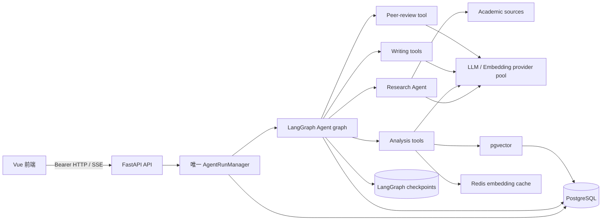
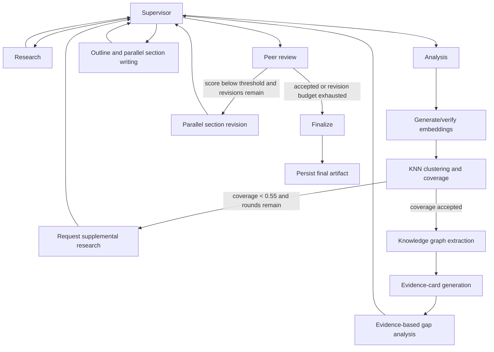
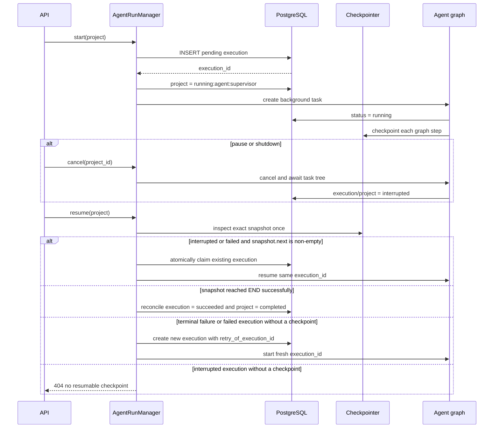

# Academic Cluster 多智能体架构

本文描述当前生产代码。流程入口位于 `src/academic_cluster/agents/agent_graph.py`，旧的 `graphs/` DAG、文件 Prompt、WebSocket 和社区可视化流程已移除。

## 系统边界



- `/api/pipeline/*` 与 `/api/agent/*` 是兼容入口，但共用同一个 `AgentRunManager`。
- PostgreSQL 的部分唯一索引保证一个项目最多存在一个 `pending` 或 `running` execution；这条约束跨进程生效。
- API 接受任务后会先同步发布 `running:agent:supervisor`；极短暂的 execution `pending` 也统一对外显示为 `running`，不会让前端误以为任务尚未启动。
- Checkpointer 初始化会持有会话级 PostgreSQL advisory lock；第二个后端实例会拒绝启动，因此当前部署契约是单进程、单 Uvicorn worker。
- 正式应用启动必须初始化 PostgreSQL checkpointer，不会静默退回内存。内存 saver 只用于直接测试图。
- 进度使用 `/api/stream/{project_id}` 的 SSE 流，令牌通过 `Authorization: Bearer` 传递，不进入 URL。

## 执行流程



Supervisor 不调用 LLM 决定路由，而是根据 `AgentState` 的完成标记、错误状态和次数预算确定下一阶段。每个业务阶段结束后都回到 Supervisor，因此状态转移只有一个决策点。

Research ReAct 只有在 `finalize_research` 对应的 `ToolMessage` 明确执行成功时才算完成；仅生成工具调用、参数校验失败或错误 ToolMessage 都不能绕过 Research 完成条件。

Analysis 内部顺序是固定的：

1. 解析本次实际 Embedding 模型，为当前项目论文生成或验证 embedding；缓存、数据库和状态使用同一模型名，向量必须是 1024 个有限数值。
2. 只在同一个 Embedding 模型空间内构建 pgvector KNN 图，再进行聚类与覆盖度分析。
3. 覆盖不足时回到 Research；覆盖通过后才继续。
4. 抽取知识图谱。KG 失败会降级为 warning，不会伪造结果。
5. 生成并持久化 evidence cards；LLM 失败产生的低置信度占位卡不会持久化或冒充可验证证据，没有真实证据卡时 Analysis 按阶段预算重试。
6. 根据 evidence claims 分析研究差距。

## 状态、隔离与恢复

`AgentState` 是 `extra="forbid"` 的 Pydantic 模型，所有 checkpoint 字段必须显式声明。关键标识如下：

```text
project_id   数据归属边界
execution_id 单次执行与恢复边界
thread_id    academic-cluster:agent:v1:{project_id}:{execution_id}
checkpoint_ns ""
```

项目论文通过 `project_papers` 关联，evidence cards、Agent decisions 和 tool calls 都带项目标识。Agent 工具使用 task-local `ContextVar` token 传递 `project_id` 与 `execution_id`，并发任务结束时 reset，不使用进程级项目栈。工具即使以结构化 `{"error": ...}` 返回降级结果，审计状态也会记录为 `failed`，不会伪装成成功调用。

启动与恢复生命周期：



应用重启时，遗留的 `pending`/`running` execution 会被标记为 `interrupted`；这一步与旧 Pipeline 残留清理相互独立，旧表异常不会阻断 Agent 恢复。恢复决策以 snapshot 为真相，而不是仅看数据库状态：只要 `snapshot.next` 非空，即使数据库已经写成 `failed` 也复用原 execution；如果图已成功到 END 但数据库还停在 `interrupted`，则直接协调为完成；终态失败保留完整历史并创建独立 thread，在 `input_state.retry_of_execution_id` 中记录来源。fresh retry 同时继承原 execution 的 topic、论文数、目标字数和质量阈值，避免恢复时任务参数漂移。

删除项目时先建立运行屏障并等待任务树退出，再清理 `checkpoints`、`checkpoint_blobs`、`checkpoint_writes` 三张 LangGraph 表（包括没有主 checkpoint 的孤儿 blob/write），最后在一个数据库事务中删除项目数据。

## 有界行为

| 行为 | 默认上限 | 结果 |
|---|---:|---|
| 单阶段失败尝试 | 2 | 达到上限后进入 Finalize 并标记失败 |
| Research 轮次 | 2 | 覆盖仍低于 0.55 时失败 |
| 同行评审修订 | 2 | 达到上限后保留 warning 并终结 |
| Research 搜索工具调用 | 6 | 包装工具在运行时强制上限 |
| 并行章节写作/修订 | 3 | `TaskGroup` + semaphore |
| Evidence 并发 | 10 | 取消父任务会取消所有子任务 |
| KG 核心论文预算 | 80 | 超出部分记录 warning |

`TaskGroup` 用于 embedding、evidence、章节写作和修订等并发工作。暂停时管理器取消并等待顶层任务，结构化并发保证子任务不会继续在后台写数据库。

## 引用一致性

写作前先按项目论文创建稳定的全局引用映射。每个章节只获得与本节相关、数量受限的来源，来源包含标题、年份、摘要和 evidence claims。

聚类 ID 被视为不透明标识，生产 UUID 与旧整数 ID 都直接贯穿引用规划；规划器不会再把 cluster ID 当作数组下标。

初稿和修订完成后，流程只校验正文中的 `[N]`，不会把 References 自身的编号误判成正文引用。最终化步骤按正文首次出现顺序重编号，并同步：

- 各章节正文；
- 最终 Markdown；
- `final_references` 中的 `new_number/original_number`；
- References 列表。

未在正文出现的论文不会进入最终 References。再次修订前，流程用 `original_number` 恢复稳定编号，避免同一个编号在不同修订轮次指向不同论文。

## 对外状态契约

项目状态统一为：

```text
pending | running | completed | failed | interrupted
```

可见阶段统一为：

```text
supervisor | research | analysis | writing | peer_review | finalize
```

前端在 SSE 断开后进行有界指数退避重连，同时继续无重叠地轮询数据库状态；收到 complete 事件后也会重新查询状态，不能仅凭连接事件把失败任务显示为成功。所有 Chat 请求、SSE 流和轮询响应都有会话代次，旧响应不能覆盖新会话。进度再按 `execution_id` 隔离：同一 checkpoint 恢复保留历史，fresh retry 自动清除旧执行阶段。

## 部署限制

默认 Docker 启动一个 Uvicorn worker，且 PostgreSQL advisory lock 强制整个数据库只有一个 Agent API 实例。专用锁连接由后台任务持续探测；连接失效会立即禁止新任务、取消并等待当前任务树，`/health` 同时返回 503。连接已经失效时，关闭流程直接丢弃该会话，不会再次执行 unlock 产生二次异常；任何发生在 ASGI `yield` 前的启动失败也会关闭已初始化服务并释放锁。任务取消句柄保存在当前进程，因此 pause、项目删除与停机等待都能覆盖完整任务树。当前不支持多个 Uvicorn worker；若未来要横向扩展，必须先实现分布式任务所有权和取消信号，再移除单实例锁。部分唯一索引仍作为数据库层的重复执行防线。

生产环境还会在启动时拒绝 debug、通配符 CORS、非 HMAC JWT 算法、公开占位符、弱数据库/JWT/Admin 密码或缺失的 `PROVIDER_ENCRYPTION_KEY`，并要求 LLM 与 Embedding pool 都已就绪。CORS 同时兼容 CSV 与旧 JSON 数组配置；通配符开发模式不会携带 credentials。PostgreSQL、Redis 凭据都通过结构化/百分号编码构造连接信息，密码中的 URL 分隔符不会改变连接目标。Provider 完成审计以 LiteLLM 响应中的实际 deployment 为准，记录真实 alias、base URL、key hint 和定价，而不是预选候选端点。Compose 的 PostgreSQL/Redis 宿主端口只绑定 `127.0.0.1`。`/health` 同时检查 checkpoint 单实例锁及两类 Agent provider，因此是 readiness 检查而不是固定存活响应。
