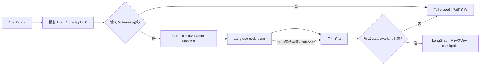
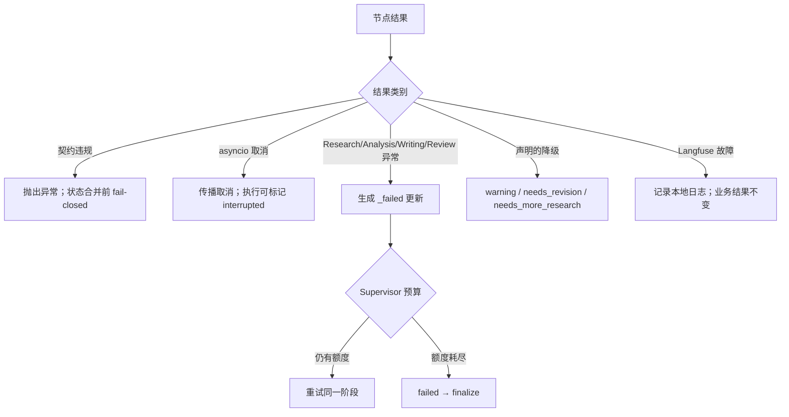

# Agent 节点契约、Artifact 与可观测性规范

本文定义 Academic Cluster 六个生产 `StateGraph` 节点的执行契约。适用节点固定为 `supervisor`、`research`、`analysis`、`writing`、`peer_review`、`finalize`，当前契约版本、Manifest 版本和 fixture 版本均为 `1.0.0`。

> 权威性约定：本文是便于评审和运维的人工说明，不是第二份 Schema。由 [`scripts/export_node_contracts.py`](../scripts/export_node_contracts.py) 生成的 [`promptfoo/contracts/node-contracts.json`](../promptfoo/contracts/node-contracts.json) 是图拓扑、`NodeContract`、Artifact JSON Schema、运行时 fixture、验收结果和 Promptfoo 场景的机器权威 bundle。本文与 bundle 冲突时，以 bundle 和生产源码为准；不得通过手工修改 bundle 来“修复”漂移。

## 1. 实现边界与权威来源

| 能力 | 权威实现 |
|------|----------|
| 六节点注册表、Artifact 声明、错误/回退、fixture 和验收 | [`src/academic_cluster/agents/node_contracts.py`](../src/academic_cluster/agents/node_contracts.py) |
| 运行前后校验、`InvocationManifest`、结构化日志和 span 包装 | [`src/academic_cluster/agents/node_runtime.py`](../src/academic_cluster/agents/node_runtime.py) |
| 节点业务实现、确定性路由和 LangGraph 拓扑 | [`src/academic_cluster/agents/agent_graph.py`](../src/academic_cluster/agents/agent_graph.py) |
| Langfuse v4 隐私、脱敏、采样和 fail-open 适配 | [`src/academic_cluster/services/langfuse_observability.py`](../src/academic_cluster/services/langfuse_observability.py) |
| 契约查询 API | [`src/academic_cluster/api/agent_routes.py`](../src/academic_cluster/api/agent_routes.py) |
| Promptfoo 配置、离线 Provider 与断言 | [`promptfoo/promptfooconfig.yaml`](../promptfoo/promptfooconfig.yaml)、[`promptfoo/providers/node_contract_provider.py`](../promptfoo/providers/node_contract_provider.py)、[`promptfoo/assertions/node_contract_assertion.py`](../promptfoo/assertions/node_contract_assertion.py) |
| Promptfoo fixture Schema | [`promptfoo/contracts/node-acceptance-fixture.schema.json`](../promptfoo/contracts/node-acceptance-fixture.schema.json) |

图编译时，`agent_graph.py` 会验证实际节点映射顺序与 `NODE_NAMES` 完全相同。新增、删除、改名或漏登记节点会拒绝构图，而不是让无契约节点进入生产流程。

## 2. 通用 NodeContract 协议

### 2.1 节点接口

所有生产节点使用同一接口约定：

```python
@enforce_node_contract("<node_name>")
async def _<node_name>_node(state: AgentState) -> dict[str, Any]:
    ...
```

- 调用方传入完整、`extra="forbid"` 的 Pydantic `AgentState`；节点并不直接接收 Artifact 对象。
- 包装器只投影该节点声明读取的字段，形成版本化输入 Artifact。完整状态中的其他字段不会进入输入 Artifact。
- 节点返回 LangGraph 的局部状态更新 `dict`，不是完整状态快照。
- 输出更新拒绝未声明字段，并必须由 `status` 唯一选择一个输出 variant；通过后才允许 LangGraph 合并和 checkpoint。
- `NodeContract.context.invocations` 是可审计的静态依赖/参数绑定声明，并会写入 Langfuse 元数据；它不替代依赖本身的业务校验。

### 2.2 Artifact 标识、版本和 JSON Schema

每个节点有两份稳定 Artifact：

```text
academic-cluster.agent.<node>.input@1.0.0
academic-cluster.agent.<node>.output@1.0.0
```

Artifact JSON Schema 使用 Draft 2020-12，`$id` 形式为 `urn:academic-cluster:agent-artifact:<node>:<direction>:1.0.0`，并带有 `x-artifact-id`、`x-artifact-version`、`x-node` 和 `x-direction`。共同约定如下：

- Artifact 顶层 `additionalProperties=false`。
- `integer` 不接受布尔值；`number` 接受有限的整数或浮点数，但不接受布尔值、`NaN` 或无穷值。
- `object` 必须是 JSON 映射，`array` 必须是列表。
- 本版 Schema 精确约束顶层字段、必填性、JSON 类型、可空性和输出分支。数组元素及对象内部的领域结构仍由各业务模型/验证器负责；若把新的嵌套约束提升为 Artifact 兼容性边界，应按版本策略升级契约。
- 输入从完整状态投影后校验；输出直接以 `reject_unknown=true` 校验，所以节点不得偷偷返回未登记字段。

下文 Schema 简写中，`*` 表示所有输出分支共同必填，`|null` 表示可空；输入字段另有说明时除外均为必填。

### 2.3 ContextManifest 与 InvocationManifest

运行时 `ContextManifest` 与 `NodeContract.context` 的静态依赖清单用途不同：前者标识一次真实调用和 Schema 来源，后者声明节点阶段、任务局部上下文、依赖操作和副作用。

| `ContextManifest` 字段 | 约束 |
|------------------------|------|
| `manifest_version` | 固定 `1.0.0` |
| `contract_version` | 固定 `1.0.0` |
| `node` | 六个注册节点之一 |
| `project_id` | 非空字符串，数据归属边界 |
| `execution_id` | 非空字符串，单次执行、trace 和 checkpoint 边界 |
| `input_artifact_ref` | 精确输入 Artifact 的 `artifact_id@version` |
| `input_schema_digest` | 对规范化输入 JSON Schema 计算的 `sha256:<64 hex>` |

`InvocationManifest` 复制并交叉校验以上身份字段，同时包含嵌套 `context`、完整的版本化输入 Artifact，以及对“ContextManifest + 输入 Artifact”规范 JSON 计算出的确定性 `invocation_id`。同一节点、同一身份和同一输入得到相同 invocation digest；任一输入或 Schema 引用变化都会改变 digest。

即使某节点（当前为 `finalize`）没有把 `execution_id` 列入业务输入 Artifact，完整 `AgentState` 仍必须提供非空 `execution_id`，因为它是运行时 ContextManifest 的强制身份字段。

### 2.4 契约执行流程



## 3. 六节点完整契约

### 3.1 `supervisor`

职责：只做确定性阶段选择、重试预算判断、终止判断和最佳努力的决策审计；不调用 LLM。

#### 输入 Artifact

- 引用：`academic-cluster.agent.supervisor.input@1.0.0`
- 以下字段全部必填，除此之外无字段：`project_id:string`、`execution_id:string`、`status:string`、`terminal_failure:boolean`、`failed_phase:string|null`、`phase_attempts:object`、`max_phase_attempts:integer`、`research_round:integer`、`max_research_rounds:integer`、`needs_revision:boolean`、`revision_attempt:integer`、`max_revision_attempts:integer`、`research_complete:boolean`、`papers:array`、`analysis_complete:boolean`、`writing_complete:boolean`、`final_review:string`、`peer_review_complete:boolean`、`errors:array`、`warnings:array`。

#### Context、依赖与参数绑定

- 静态阶段：`supervisor`。
- 任务局部 `context_vars`：无；运行时 ContextManifest 仍强制绑定 `project_id` 和 `execution_id`。
- 副作用：最佳努力写入 supervisor decision audit。

| operation | required | side effect | 参数绑定 |
|-----------|----------|-------------|----------|
| `decide_next_phase` | 是 | 否 | `state <-` 上述全部输入字段，表达式为 `AgentState` |
| `database.record_agent_decision` | 否 | 是 | `execution_id <- execution_id`；`project_id <- project_id`；`decision <- decide_next_phase(state)`；`reason <- computed branch reason` |

#### 输出 Artifact 与 status variants

- 引用：`academic-cluster.agent.supervisor.output@1.0.0`
- 字段全集：`current_phase:string*`、`status:string*`、`decision_reason:string*`、`research_complete:boolean`、`analysis_complete:boolean`、`embeddings_ready:boolean`、`terminal_failure:boolean`、`errors:array`、`failed_phase:string|null`、`writing_complete:boolean`、`peer_review_complete:boolean`、`needs_revision:boolean`、`warnings:array`。

| variant | `status` | 分支额外必填 | 语义 |
|---------|----------|--------------|------|
| `route` | `running` | 无 | 正常路由或有界重试仍可继续 |
| `finalize` | `finalizing` | 无 | 必需阶段已完成，进入收尾 |
| `terminal_failure` | `failed` | `terminal_failure` | 覆盖或阶段重试预算耗尽 |
| `revision_exhausted` | `completed_with_warnings` | `needs_revision`、`warnings` | 修订预算耗尽，保留已有综述和告警 |

#### Declared errors 与回退

异常策略为 `best_effort_only`，取消一律传播，无阶段重试字段。

| code | 触发/异常 | handling | retryable | terminal | result status |
|------|-----------|----------|-----------|----------|---------------|
| `contract_violation` | 输入或输出不符合版本化 Schema；`NodeContractValidationError` | `fail_closed` | 否 | 是 | `failed` |
| `cancelled` | `asyncio.CancelledError` | `propagate` | 否 | 否 | `interrupted` |
| `decision_audit_persistence_error` | `record_agent_decision` 抛出 `Exception` | `best_effort` | 否 | 否 | 不改变业务状态 |

| fallback trigger | action | resulting status | terminal |
|------------------|--------|------------------|----------|
| 决策审计持久化失败 | 记录本地 warning，保留路由结果 | 不改变 | 否 |
| 覆盖重试预算耗尽 | 标记终止失败 | `failed` | 是 |
| 修订预算耗尽 | 保留 review 并追加 warning | `completed_with_warnings` | 是 |

#### Fixture 与六项验收

- Promptfoo fixture：[`promptfoo/fixtures/supervisor.json`](../promptfoo/fixtures/supervisor.json)。入口上下文要求 `project_id`、`execution_id`、`topic`；happy path 期望 `route`。
- error 场景：`fail_closed`，状态路由到 `finalize`；fallback 场景：`bounded_completion`，路由到 `finalize`。
- 六项 `NodeContract` 验收：
  1. `supervisor.input.version = 1.0.0`；
  2. `supervisor.input.required` 等于本节输入字段全集；
  3. `supervisor.input.types` 等于本节逐字段 JSON 类型；
  4. `supervisor.output.variant = [route, finalize, terminal_failure, revision_exhausted]`；
  5. `supervisor.error.policy = {cancellation: propagate, exception_policy: best_effort_only}`；
  6. `supervisor.fallback.policy = {minimum_rules: 1}`。

### 3.2 `research`

职责：按主题和补充查询获取项目范围内论文，拒绝空论文结果，并输出去重后的论文标识与检索摘要。

#### 输入 Artifact

- 引用：`academic-cluster.agent.research.input@1.0.0`
- 以下字段全部必填：`project_id:string`、`execution_id:string`、`topic:string`、`target_papers:integer`、`suggested_queries:array`、`research_round:integer`、`phase_attempts:object`、`max_phase_attempts:integer`、`errors:array`、`warnings:array`。

#### Context、依赖与参数绑定

- 静态阶段：`research`。
- 任务局部 `context_vars`：`project_id`、`execution_id`、`agent_phase`；节点退出时必须按 token reset。
- 副作用：research tools 内部的论文持久化与项目关联。

| operation | required | side effect | 参数绑定 |
|-----------|----------|-------------|----------|
| `research_team.run_research` | 是 | 否（调用链内部另有持久化） | `topic <- topic`；`project_id <- project_id`；`target_papers <- target_papers`；`supplemental_queries <- suggested_queries` |

#### 输出 Artifact 与 status variants

- 引用：`academic-cluster.agent.research.output@1.0.0`
- 字段全集：`current_phase:string*`、`status:string*`、`papers:array`、`paper_ids:array`、`research_summary:object`、`research_complete:boolean`、`research_round:integer`、`suggested_queries:array`、`failed_phase:string|null*`、`terminal_failure:boolean*`、`phase_attempts:object`、`errors:array`、`warnings:array`。

| variant | `status` | 分支额外必填 | 语义 |
|---------|----------|--------------|------|
| `success` | `running` | `papers`、`paper_ids`、`research_summary`、`research_complete`、`research_round`、`suggested_queries` | 返回项目范围论文并完成去重 |
| `phase_failure` | `research_failed` | `phase_attempts`、`errors`、`warnings` | 转换为 supervisor 可处理的有界阶段重试状态 |

#### Declared errors 与回退

异常策略为 `phase_retry`，失败状态为 `research_failed`，预算字段为 `phase_attempts`、`max_phase_attempts`。

| code | 触发/异常 | handling | retryable | terminal | result status |
|------|-----------|----------|-----------|----------|---------------|
| `contract_violation` | `NodeContractValidationError` | `fail_closed` | 否 | 是 | `failed` |
| `cancelled` | `asyncio.CancelledError` | `propagate` | 否 | 否 | `interrupted` |
| `phase_execution_error` | research 在产生有效成功/回退输出前抛出 `Exception` | `phase_retry` | 是 | 否 | `research_failed` |
| `phase_retry_exhausted` | 阶段尝试数达到上限 | `phase_retry` | 否 | 是 | `research_failed` |

| fallback trigger | action | resulting status | terminal |
|------------------|--------|------------------|----------|
| research 未返回项目论文 | 抛错并进入有界阶段重试 | `research_failed` | 否（预算耗尽后由 supervisor 终止） |

#### Fixture 与六项验收

- Promptfoo fixture：[`promptfoo/fixtures/research.json`](../promptfoo/fixtures/research.json)。入口上下文要求 `project_id`、`execution_id`、`topic`、`target_papers`；happy path 期望 `success`。
- error 场景：`bounded_retry`，路由回 `research`；fallback 场景：`prohibit_empty_research`，预算耗尽后路由到 `finalize`。
- 六项验收：
  1. `research.input.version = 1.0.0`；
  2. `research.input.required` 等于本节输入字段全集；
  3. `research.input.types` 等于本节逐字段 JSON 类型；
  4. `research.output.variant = [success, phase_failure]`；
  5. `research.error.policy = {cancellation: propagate, exception_policy: phase_retry}`；
  6. `research.fallback.policy = {minimum_rules: 1}`。

### 3.3 `analysis`

职责：保证论文 Embedding、计算聚类覆盖度、在覆盖不足时请求补充检索，并在覆盖通过后生成知识图谱、真实 evidence cards 与 gap analysis。

#### 输入 Artifact

- 引用：`academic-cluster.agent.analysis.input@1.0.0`
- 以下字段全部必填：`project_id:string`、`execution_id:string`、`topic:string`、`target_papers:integer`、`papers:array`、`warnings:array`、`phase_attempts:object`、`max_phase_attempts:integer`、`errors:array`。

#### Context、依赖与参数绑定

- 静态阶段：`analysis`。
- 任务局部 `context_vars`：`project_id`、`execution_id`、`agent_phase`。
- 副作用：Embedding、cluster、knowledge graph 和 evidence card 持久化。

| operation | required | side effect | 参数绑定 |
|-----------|----------|-------------|----------|
| `embedding_service.get_active_embedding_model` | 是 | 否 | 无参数 |
| `embedding_service.ensure_paper_embeddings` | 是 | 否（服务内部持久化） | `papers <- papers`；`model_name <- get_active_embedding_model()` |
| `agent_tools.cluster_and_evaluate_coverage` | 是 | 否（工具内部持久化） | `topic <- topic`；`target_papers <- target_papers`；`embedding_model <- active model` |
| `agent_tools.extract_knowledge_graph` | 否 | 否（工具内部持久化） | `papers_json <- papers`，表达式为 bounded JSON |
| `agent_tools.generate_evidence` | 是 | 否（工具内部持久化） | `papers_json <- papers`，表达式为 bounded JSON；`topic <- topic` |
| `agent_tools.analyze_gaps_from_evidence` | 否 | 否 | `evidence_count <- len(generated cards)`；`key_claims_json <- first 20 evidence_cards claims JSON`；`topic <- topic` |

#### 输出 Artifact 与 status variants

- 引用：`academic-cluster.agent.analysis.output@1.0.0`
- 字段全集：`current_phase:string*`、`status:string*`、`embeddings_ready:boolean`、`embedding_model:string`、`coverage:object`、`coverage_score:number`、`suggested_queries:array`、`analysis_complete:boolean`、`failed_phase:string|null*`、`terminal_failure:boolean*`、`warnings:array*`、`knowledge_graph:object`、`evidence_cards:array`、`gap_analysis:object`、`phase_attempts:object`、`errors:array`。

| variant | `status` | 分支额外必填 | 语义 |
|---------|----------|--------------|------|
| `supplemental_research` | `needs_more_research` | `embeddings_ready`、`embedding_model`、`coverage`、`coverage_score`、`suggested_queries`、`analysis_complete` | 覆盖分数低于 `0.55`，请求有界补充检索 |
| `success` | `running` | `embeddings_ready`、`embedding_model`、`coverage`、`coverage_score`、`knowledge_graph`、`evidence_cards`、`gap_analysis`、`analysis_complete` | 覆盖度和真实证据足以进入写作 |
| `phase_failure` | `analysis_failed` | `phase_attempts`、`errors` | 必需分析失败并进入有界重试 |

#### Declared errors 与回退

异常策略为 `phase_retry`，失败状态为 `analysis_failed`，预算字段为 `phase_attempts`、`max_phase_attempts`。

| code | 触发/异常 | handling | retryable | terminal | result status |
|------|-----------|----------|-----------|----------|---------------|
| `contract_violation` | `NodeContractValidationError` | `fail_closed` | 否 | 是 | `failed` |
| `cancelled` | `asyncio.CancelledError` | `propagate` | 否 | 否 | `interrupted` |
| `phase_execution_error` | analysis 在产生有效成功/回退输出前抛出 `Exception` | `phase_retry` | 是 | 否 | `analysis_failed` |
| `phase_retry_exhausted` | 阶段尝试数达到上限 | `phase_retry` | 否 | 是 | `analysis_failed` |

| fallback trigger | action | resulting status | terminal |
|------------------|--------|------------------|----------|
| `coverage_score < 0.55` | 使用建议查询；没有建议时使用原 topic | `needs_more_research` | 否 |
| KG 抽取错误或截断 | 追加 warning，继续使用 evidence | `running` | 否 |
| gap analysis 返回 error | 追加 warning，保留降级 gap Artifact | `running` | 否 |
| 没有真实 evidence cards | 抛错并进入有界阶段重试 | `analysis_failed` | 否（预算耗尽后终止） |

#### Fixture 与六项验收

- Promptfoo fixture：[`promptfoo/fixtures/analysis.json`](../promptfoo/fixtures/analysis.json)。入口上下文要求 `project_id`、`execution_id`、`topic`、`papers`、`research_complete`；happy path 期望 `success`。
- error 场景：`bounded_retry`，路由回 `analysis`；fallback 场景：`bounded_supplemental_research`，路由回 `research`。
- 六项验收：
  1. `analysis.input.version = 1.0.0`；
  2. `analysis.input.required` 等于本节输入字段全集；
  3. `analysis.input.types` 等于本节逐字段 JSON 类型；
  4. `analysis.output.variant = [supplemental_research, success, phase_failure]`；
  5. `analysis.error.policy = {cancellation: propagate, exception_policy: phase_retry}`；
  6. `analysis.fallback.policy = {minimum_rules: 1}`。

### 3.4 `writing`

职责：生成或修订 grounded review，规划引用和章节证据，冻结引用编号，形成最终 Markdown，并持久化大纲与章节。

#### 输入 Artifact

- 引用：`academic-cluster.agent.writing.input@1.0.0`
- 以下字段全部必填：`project_id:string`、`execution_id:string`、`topic:string`、`target_words:integer`、`papers:array`、`evidence_cards:array`、`coverage:object`、`reference_map:array`、`needs_revision:boolean`、`outline:object`、`sections:array`、`final_references:array`、`revision_feedback:string`、`revision_attempt:integer`、`quality_score:number|null`、`phase_attempts:object`、`max_phase_attempts:integer`、`errors:array`、`warnings:array`。

#### Context、依赖与参数绑定

- 静态阶段：`writing`。
- 任务局部 `context_vars`：`project_id`、`execution_id`、`agent_phase`。
- 副作用：大纲和写作章节持久化。

| operation | required | side effect | 参数绑定 |
|-----------|----------|-------------|----------|
| `writing_team.run_writing` | 否 | 否 | `topic <- topic`；`evidence_cards <- evidence_cards`；`target_words <- target_words` |
| `citation_planner.plan_review_citations` | 否 | 否 | `sections <- outline`；`papers <- papers, reference_map`；`clusters <- coverage` |
| `section_evidence_planner.plan_section_evidence` | 否 | 否 | `topic <- topic`；`evidence_cards <- evidence_cards`；`papers <- papers`；`clusters <- coverage` |
| `agent_tools.write_section` | 否 | 否 | `topic <- topic`；`section_plan_json <- outline`；`available_papers_json <- papers, reference_map, evidence_cards` |
| `agent_tools.revise_section` | 否 | 否 | `section_text <- sections, final_references`；`revision_instructions <- revision_feedback` |
| `review_finalizer.finalize_review_markdown` | 是 | 否 | `review_title <- outline, topic`；`sections <- outline`；`section_bodies <- sections`；`paper_metadata_map <- reference_map`；`abstract <- computed from sections` |
| `database.save_outline` | 是 | 是 | `project_id <- project_id`；`outline <- outline`；`revision_attempt <- revision_attempt` |
| `database.save_written_section` | 是 | 是 | `sections <- sections`；`revision_attempt <- revision_attempt`；`quality_score <- quality_score` |

`required=false` 表示该调用只在相应生成/修订分支出现，并不允许最终产物绕过引用、证据或长度验证；最终 Markdown 生成和数据库持久化仍是成功 variant 的硬边界。

#### 输出 Artifact 与 status variants

- 引用：`academic-cluster.agent.writing.output@1.0.0`
- 字段全集：`current_phase:string*`、`status:string*`、`outline:object`、`sections:array`、`reference_map:array`、`cited_reference_numbers:array`、`final_references:array`、`abstract:string`、`final_review:string`、`writing_complete:boolean`、`needs_revision:boolean`、`revision_feedback:string`、`peer_review_complete:boolean`、`revision_attempt:integer`、`failed_phase:string|null*`、`terminal_failure:boolean*`、`phase_attempts:object`、`errors:array`、`warnings:array`。

| variant | `status` | 分支额外必填 | 语义 |
|---------|----------|--------------|------|
| `success` | `running` | `outline`、`sections`、`reference_map`、`cited_reference_numbers`、`final_references`、`abstract`、`final_review`、`writing_complete`、`needs_revision`、`revision_feedback`、`peer_review_complete`、`revision_attempt` | grounded sections 与最终 Markdown 通过校验 |
| `phase_failure` | `writing_failed` | `phase_attempts`、`errors`、`warnings` | 写作或 Artifact 持久化进入有界重试 |

#### Declared errors 与回退

异常策略为 `phase_retry`，失败状态为 `writing_failed`，预算字段为 `phase_attempts`、`max_phase_attempts`。

| code | 触发/异常 | handling | retryable | terminal | result status |
|------|-----------|----------|-----------|----------|---------------|
| `contract_violation` | `NodeContractValidationError` | `fail_closed` | 否 | 是 | `failed` |
| `cancelled` | `asyncio.CancelledError` | `propagate` | 否 | 否 | `interrupted` |
| `phase_execution_error` | writing 在产生有效成功/回退输出前抛出 `Exception` | `phase_retry` | 是 | 否 | `writing_failed` |
| `phase_retry_exhausted` | 阶段尝试数达到上限 | `phase_retry` | 否 | 是 | `writing_failed` |

| fallback trigger | action | resulting status | terminal |
|------------------|--------|------------------|----------|
| `needs_revision=true` | 修订已有章节并恢复原引用编号 | `running` | 否 |
| 引用、证据规划或最小长度校验失败 | 抛错并进入有界阶段重试 | `writing_failed` | 否（预算耗尽后终止） |

#### Fixture 与六项验收

- Promptfoo fixture：[`promptfoo/fixtures/writing.json`](../promptfoo/fixtures/writing.json)。入口上下文要求 `project_id`、`execution_id`、`topic`、`papers`、`evidence_cards`、`analysis_complete`；happy path 期望 `success`。
- error 场景：`bounded_retry`，路由回 `writing`；fallback 场景：`bounded_revision`，仍路由到 `writing`。
- 六项验收：
  1. `writing.input.version = 1.0.0`；
  2. `writing.input.required` 等于本节输入字段全集；
  3. `writing.input.types` 等于本节逐字段 JSON 类型；
  4. `writing.output.variant = [success, phase_failure]`；
  5. `writing.error.policy = {cancellation: propagate, exception_policy: phase_retry}`；
  6. `writing.fallback.policy = {minimum_rules: 1}`。

### 3.5 `peer_review`

职责：对最终综述执行结构化同行评审、验证报告，并依据质量阈值及修订预算决定通过、返工或带告警完成。

#### 输入 Artifact

- 引用：`academic-cluster.agent.peer_review.input@1.0.0`
- 以下字段全部必填：`project_id:string`、`execution_id:string`、`topic:string`、`final_review:string`、`quality_threshold:number`、`revision_attempt:integer`、`max_revision_attempts:integer`、`warnings:array`、`phase_attempts:object`、`max_phase_attempts:integer`、`errors:array`。

#### Context、依赖与参数绑定

- 静态阶段：`peer_review`。
- 任务局部 `context_vars`：`project_id`、`execution_id`、`agent_phase`。
- 副作用：无。

| operation | required | side effect | 参数绑定 |
|-----------|----------|-------------|----------|
| `peer_review_team.run_peer_review` | 是 | 否 | `review_text <- final_review`；`topic <- topic` |
| `peer_review_team.validate_peer_review_report` | 是 | 否 | `report <- run_peer_review result` |

#### 输出 Artifact 与 status variants

- 引用：`academic-cluster.agent.peer_review.output@1.0.0`
- 字段全集：`current_phase:string*`、`status:string*`、`peer_review_report:object`、`quality_score:number|null`、`peer_review_complete:boolean`、`needs_revision:boolean`、`revision_feedback:string`、`failed_phase:string|null*`、`terminal_failure:boolean`、`warnings:array`、`phase_attempts:object`、`errors:array`。

| variant | `status` | 分支额外必填 | 语义 |
|---------|----------|--------------|------|
| `revision_requested` | `needs_revision` | `peer_review_report`、`quality_score`、`peer_review_complete`、`needs_revision`、`revision_feedback` | 低于阈值且仍有修订额度，返回 writing |
| `threshold_warning` | `completed_with_warnings` | `peer_review_report`、`quality_score`、`peer_review_complete`、`needs_revision`、`warnings` | 修订额度已用尽，保留 review 并带告警完成 |
| `success` | `running` | `peer_review_report`、`quality_score`、`peer_review_complete`、`needs_revision`、`terminal_failure` | 已验证分数达到质量阈值 |
| `phase_failure` | `peer_review_failed` | `terminal_failure`、`phase_attempts`、`errors`、`warnings` | 缺失正文或无效报告进入有界阶段重试 |

#### Declared errors 与回退

异常策略为 `phase_retry`，失败状态为 `peer_review_failed`，预算字段为 `phase_attempts`、`max_phase_attempts`。

| code | 触发/异常 | handling | retryable | terminal | result status |
|------|-----------|----------|-----------|----------|---------------|
| `contract_violation` | `NodeContractValidationError` | `fail_closed` | 否 | 是 | `failed` |
| `cancelled` | `asyncio.CancelledError` | `propagate` | 否 | 否 | `interrupted` |
| `phase_execution_error` | peer review 在产生有效成功/回退输出前抛出 `Exception` | `phase_retry` | 是 | 否 | `peer_review_failed` |
| `phase_retry_exhausted` | 阶段尝试数达到上限 | `phase_retry` | 否 | 是 | `peer_review_failed` |

| fallback trigger | action | resulting status | terminal |
|------------------|--------|------------------|----------|
| 分数低于阈值且仍有修订额度 | 保存反馈并路由回 writing | `needs_revision` | 否 |
| 修订额度耗尽后仍低于阈值 | 保留 review，带 warning 完成 | `completed_with_warnings` | 是 |

#### Fixture 与六项验收

- Promptfoo fixture：[`promptfoo/fixtures/peer_review.json`](../promptfoo/fixtures/peer_review.json)。入口上下文要求 `project_id`、`execution_id`、`topic`、`final_review`、`writing_complete`、`quality_threshold`；happy path 期望 `success`。
- error 场景：`bounded_retry`，路由回 `peer_review`；fallback 场景：`quality_revision`，路由回 `writing`。
- 六项验收：
  1. `peer_review.input.version = 1.0.0`；
  2. `peer_review.input.required` 等于本节输入字段全集；
  3. `peer_review.input.types` 等于本节逐字段 JSON 类型；
  4. `peer_review.output.variant = [revision_requested, threshold_warning, success, phase_failure]`；
  5. `peer_review.error.policy = {cancellation: propagate, exception_policy: phase_retry}`；
  6. `peer_review.fallback.policy = {minimum_rules: 1}`。

### 3.6 `finalize`

职责：根据终止失败、正文存在性和 warning 计算最终状态，并持久化最终 review Artifact checkpoint。

#### 输入 Artifact

- 引用：`academic-cluster.agent.finalize.input@1.0.0`
- 以下字段全部必填：`project_id:string`、`terminal_failure:boolean`、`final_review:string`、`status:string`、`warnings:array`、`final_references:array`、`abstract:string`、`outline:object`、`peer_review_report:object`、`quality_score:number|null`、`coverage:object`。
- `execution_id` 不属于本节点的业务输入 Artifact，但仍是构建 ContextManifest 和 Langfuse trace 的强制运行时字段。

#### Context、依赖与参数绑定

- 静态阶段：`finalize`。
- 任务局部 `context_vars`：无。
- 副作用：持久化 `final_review_artifact` pipeline checkpoint。

| operation | required | side effect | 参数绑定 |
|-----------|----------|-------------|----------|
| `database.save_pipeline_checkpoint` | 否 | 是 | `project_id <- project_id`；`state_snapshot <- final_review, final_references, abstract, outline, peer_review_report, quality_score, coverage, warnings`；`status <- derived from terminal_failure, final_review, status, warnings` |

这里的 `required=false` 表示空正文/终止失败分支可以合法跳过持久化；当正文存在且实际执行保存时，持久化异常按声明传播，不会伪装为成功。

#### 输出 Artifact 与 status variants

- 引用：`academic-cluster.agent.finalize.output@1.0.0`
- 字段全集：`current_phase:string*`、`status:string*`。

| variant | `status` | 分支额外必填 | 语义 |
|---------|----------|--------------|------|
| `success` | `completed` | 无 | 无 warning 的正常完成 |
| `warning` | `completed_with_warnings` | 无 | 保留 warning 的完成 |
| `failure` | `failed` | 无 | 终止失败或缺少最终正文 |

#### Declared errors 与回退

异常策略为 `propagate`，取消也传播，无阶段重试字段。

| code | 触发/异常 | handling | retryable | terminal | result status |
|------|-----------|----------|-----------|----------|---------------|
| `contract_violation` | `NodeContractValidationError` | `fail_closed` | 否 | 是 | `failed` |
| `cancelled` | `asyncio.CancelledError` | `propagate` | 否 | 否 | `interrupted` |
| `finalize_persistence_error` | 正文存在时 `save_pipeline_checkpoint` 抛出 `Exception` | `propagate` | 否 | 是 | `failed` |

| fallback trigger | action | resulting status | terminal |
|------------------|--------|------------------|----------|
| `terminal_failure=true` 或 `final_review` 为空 | 返回失败；正文为空时跳过 Artifact 持久化 | `failed` | 是 |
| 已有 warning 或状态为 `completed_with_warnings` | 在最终 Artifact 中保留 warning | `completed_with_warnings` | 是 |

#### Fixture 与六项验收

- Promptfoo fixture：[`promptfoo/fixtures/finalize.json`](../promptfoo/fixtures/finalize.json)。入口上下文要求 `project_id`、`execution_id`、`topic`、`final_review`、`peer_review_complete`；happy path 期望 `success`。
- error 场景：`terminal_failure`，路由到 `__end__`；fallback 场景：`warning_completion`，路由到 `__end__`。
- 六项验收：
  1. `finalize.input.version = 1.0.0`；
  2. `finalize.input.required` 等于本节输入字段全集；
  3. `finalize.input.types` 等于本节逐字段 JSON 类型；
  4. `finalize.output.variant = [success, warning, failure]`；
  5. `finalize.error.policy = {cancellation: propagate, exception_policy: propagate}`；
  6. `finalize.fallback.policy = {minimum_rules: 1}`。

## 4. 错误、回退与状态合并语义



关键边界：

- 契约违规不是可恢复的业务 fallback。输入、版本、类型、输出未知字段或 status variant 违规会在状态合并前抛出 `NodeContractValidationError`。
- `research`、`analysis`、`writing`、`peer_review` 的普通业务异常由节点转换为 `<phase>_failed` 局部更新；Supervisor 使用 `phase_attempts/max_phase_attempts` 决定重试或终止。
- `asyncio.CancelledError` 从所有节点直接传播，不得被宽泛的 `except Exception` 吞掉。
- `supervisor` 只有决策审计是 best-effort；`finalize` 的实际持久化异常会传播。
- 合法降级必须生成已声明的 status variant，不能靠日志或未登记字段表达。

## 5. Fixture 与 Promptfoo 验收模型

### 5.1 两层 fixture

1. `node_contracts.py` 的 `build_deterministic_fixture()` 为每个节点生成完整 `AgentState` 输入和 happy-path 输出，通过 `accept_node_fixture()` 实际投影输入 Artifact、验证输出 variant，并返回输入/输出 Artifact 与六个 criterion ID。
2. [`promptfoo/fixtures`](../promptfoo/fixtures) 的六份 JSON 场景同时声明节点入口上下文、error 状态补丁、fallback 状态补丁和预期路由。导出器会把补丁合并到真实 `AgentState`，再调用生产 `decide_next_phase`/route 函数验证路由，不复制一套路由算法。

Promptfoo fixture 必须符合 `agent-node-acceptance-fixture-v1` Schema：顶层只允许 `fixture_version`、`schema`、`node`、`contract_version`、`expected_variant`、`context`、`error`、`fallback`、`acceptance`。`acceptance` 固定要求 `expected_accepted=true`、`expected_artifact_version=1.0.0`。

### 5.2 六节点场景矩阵

| node | happy variant | error mode → route | fallback mode → route |
|------|---------------|--------------------|-----------------------|
| `supervisor` | `route` | `fail_closed` → `finalize` | `bounded_completion` → `finalize` |
| `research` | `success` | `bounded_retry` → `research` | `prohibit_empty_research` → `finalize` |
| `analysis` | `success` | `bounded_retry` → `analysis` | `bounded_supplemental_research` → `research` |
| `writing` | `success` | `bounded_retry` → `writing` | `bounded_revision` → `writing` |
| `peer_review` | `success` | `bounded_retry` → `peer_review` | `quality_revision` → `writing` |
| `finalize` | `success` | `terminal_failure` → `__end__` | `warning_completion` → `__end__` |

### 5.3 Promptfoo 的六个 named scores

每条 fixture 必须同时通过以下独立断言，最终分数才为 `1.0`：

| named score | 验收内容 |
|-------------|----------|
| `contract_version` | fixture、Provider metadata、Manifest、输入/输出 Artifact 版本一致 |
| `contract_schema` | fixture Schema ID 与 Promptfoo 配置一致 |
| `contract_context` | node、入口、必需上下文字段和 Provider metadata 一致 |
| `contract_error` | error 场景结构有效且等于 fixture 声明 |
| `contract_fallback` | fallback 场景结构有效且等于 fixture 声明 |
| `contract_acceptance` | 运行时 accepted、无错误、variant 正确，且六个 `NodeContract` criterion 后缀完整 |

Promptfoo 是离线契约评估器：Provider 只加载本项目生产 acceptance API，不调用 LLM、论文源、Embedding Provider 或数据库，也不读取业务密钥。因此它验证的是接口、Schema、确定性路由和错误/回退声明，不是生成内容质量。

## 6. API、导出与检查命令

### 6.1 契约 API

- `GET /api/agent/contracts`：需要现有认证，返回 `NodeContractManifest`，其中包含 `manifest_version`、`contract_version` 和六个节点；每个节点同时返回完整 `contract`、输入 Artifact Schema、输出 Artifact Schema。
- `GET /api/agent/contracts/{node_name}`：需要认证，返回单节点条目；未知节点返回 `404 Unknown Agent node`。

API 只发布静态契约，不返回运行时正文、密钥或某次执行的 ContextManifest。运行时 invocation 身份通过结构化日志和可选 Langfuse trace 观察。

### 6.2 生成和漂移检查

在仓库根目录执行：

```bash
# 按生产注册表、真实图和六份 fixture 重新生成机器权威 bundle
uv run python scripts/export_node_contracts.py

# CI/评审使用：只检查，不修改文件；缺失或字节级漂移返回非零退出码
uv run python scripts/export_node_contracts.py --check

# 运行契约、运行时、API、Promptfoo 资产和 Langfuse 单测
uv run pytest tests/unit/test_node_contracts.py tests/unit/test_node_contract_runtime.py tests/unit/test_agent_contract_api.py tests/unit/test_promptfoo_contract_assets.py tests/unit/test_langfuse_observability.py
```

导出 bundle 固定包含：真实图节点/边、`runtime_contract_manifest`、Pydantic contract Schema、六份运行时 acceptance fixture、六份 acceptance result 和六份路由场景。`--check` 同时能发现节点集合、图路由、fixture 版本或输出快照漂移。

### 6.3 Promptfoo 固定版本与运行命令

- Promptfoo CLI 固定为 `0.121.19`，不得使用无版本的 latest。
- bundle 声明 Node engine `^20.20.0 || >=22.22.0`；CI 使用 Node 22。
- CI 设置 `PROMPTFOO_DISABLE_TELEMETRY=true`，并将 `PROMPTFOO_PYTHON` 固定为项目 `.venv/bin/python`，评估使用 `--no-cache`。

```bash
cd promptfoo
# PowerShell: 先将 Promptfoo Python provider 绑定到项目 Python 3.12
$env:PROMPTFOO_PYTHON=(Resolve-Path ..\.venv\Scripts\python.exe).Path
promptfoo eval --config promptfooconfig.yaml --no-cache --no-write
```

POSIX shell 使用 `PROMPTFOO_PYTHON="$(cd .. && pwd)/.venv/bin/python" promptfoo eval --config promptfooconfig.yaml --no-cache --no-write`。不能依赖系统 `python`：它可能是与项目依赖不兼容的旧版本。

## 7. Langfuse 可观测性、隐私与 fail-open

项目依赖 Langfuse Python SDK `>=4.14.0,<5.0.0`，适配器针对 v4 API。Langfuse 是旁路遥测，不是正确性边界：NodeContract 校验始终执行；Langfuse 未启用、缺少凭据、初始化失败、网络失败、span 更新失败、flush 或 shutdown 失败都不得改变节点返回值、路由、重试或 checkpoint。

### 7.1 Trace 结构

- `run_agent_graph` 建立 `agent.execution`（type `agent`）根 observation，使用 `execution_id` 生成稳定 trace ID。
- 每个节点建立 `agent.node.<node>`（type `span`），在同一执行 trace 下继承 `project_id`、`execution_id`、契约/Artifact/Context 版本。
- 节点 metadata 包含 `invocation_id`、输入/输出 Artifact 引用、输入 Schema digest、declared error codes 和 dependency operations。
- 成功 span 记录输出 variant、status、字段名、Artifact digest 和耗时；失败/取消记录脱敏后的异常类型与有限长度状态消息。

### 7.2 默认隐私策略

默认 `LANGFUSE_ENABLED=false` 且 `LANGFUSE_CAPTURE_NODE_IO=false`：

- execution 根 observation 不捕获输入或输出。
- node span 不上传输入 `AgentState`，输出仅上传 Schema 级摘要，不上传论文、Prompt、evidence、章节或最终综述正文。
- 只有显式启用 `LANGFUSE_CAPTURE_NODE_IO=true` 才捕获节点 I/O；捕获前仍统一递归脱敏并限制深度、条目数和文本长度。
- 默认清洗上限为深度 4、每个集合 25 项、单值 2000 字符；Bearer token、API key、cookie、credential、JWT、password、private key、secret、session/refresh token 等敏感键或文本模式替换为 `[REDACTED]`，超限值标记为 truncated。

### 7.3 配置与生产约束

| 环境变量 | 默认值 | 约定 |
|----------|--------|------|
| `LANGFUSE_ENABLED` | `false` | 只有显式开启才初始化 SDK |
| `LANGFUSE_PUBLIC_KEY` | 空 | 开启时必须提供有效值 |
| `LANGFUSE_SECRET_KEY` | 空 | 开启时必须提供有效值，不写日志 |
| `LANGFUSE_BASE_URL` | `https://cloud.langfuse.com` | 生产环境开启时必须为有效 HTTPS endpoint |
| `LANGFUSE_TRACING_ENVIRONMENT` | 可空；示例为 `development` | trace 环境标签 |
| `LANGFUSE_RELEASE` | 可空 | release 标签 |
| `LANGFUSE_SAMPLE_RATE` | `1.0` | 限制到 `[0.0, 1.0]`；非有限/非法值回退 `1.0` |
| `LANGFUSE_CAPTURE_NODE_IO` | `false` | 同时控制 node input 与实际 output 捕获 |

生产配置校验会在 `LANGFUSE_ENABLED=true` 时检查公钥、私钥和 HTTPS endpoint；遥测运行期仍保持 fail-open。关闭或缺少完整凭据时，适配器直接成为 no-op，不启动后台遥测。

## 8. 契约变更验收清单

修改任一节点前后都应执行以下流程：

1. 先修改真实节点行为，再同步 `NodeContract` 的输入字段、依赖绑定、输出字段/variant、错误和 fallback；不得为通过测试而声明不存在的调用。
2. 兼容新增可选输出字段可在评审后保留当前版本；删除/重命名字段、改变必填性/类型/status 语义或收紧消费者可见 Schema 时必须评估并升级契约版本。
3. 更新对应 Promptfoo fixture 的入口、error、fallback 和预期路由；fixture Schema 或 bundle 结构变化时同步升级 fixture/bundle 版本。
4. 运行 Artifact/运行时/API/路由单测，并确认无效输入和输出在状态合并前 fail-closed。
5. 重新导出 bundle，审查 JSON diff，再运行 `--check`。
6. 使用固定 Promptfoo 版本执行六节点离线评估，要求每条 fixture 的六个 named scores 全部为 `1.0`。
7. 验证 Langfuse 关闭、缺凭据和 SDK 抛错时业务结果不变；若开启正文捕获，额外验证脱敏与截断。
